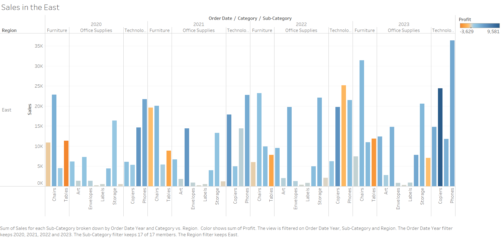
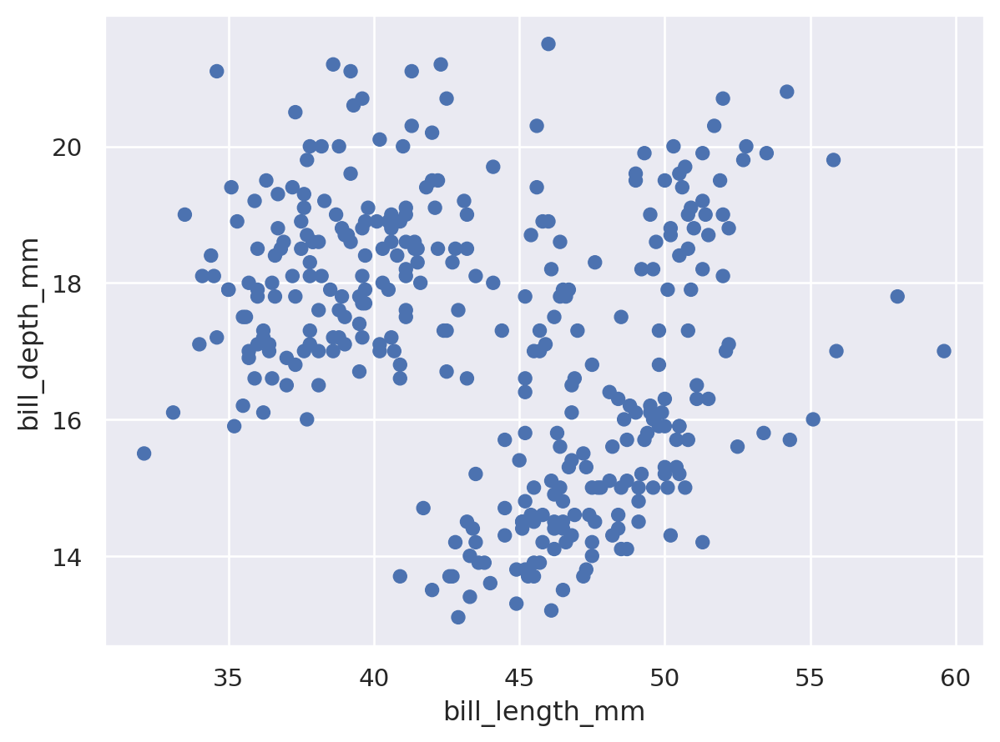

# HW 1 - CS 625, Fall 2023

Maaz Hasnain Khan 
Due: September 6, 2023

## Git, GitHub

*What is the URL of the GitHub repo that you created in your personal account?*

Below is the URL of the Github repo that I created in my personal account. I have also made my new repository publicly available so that it can be accessible to everyone.

### Github URL
https://github.com/maazhasnainkhan/CS625-HW1.git
   
*In which direction does the 'pull' command work (send local changes to remote OR send remote changes to local)?*

The 'pull' command send remote changes to local. I created a file2.txt in my personal account repository and made changes to it remotely and pulled that change to my local machine. This way I got to know about this command in a more practical way.
   
*If you have committed a change on your local machine, but do not see the update on GitHub.com, what step might have you forgotten?*

Although I committed a change and then push it live in my remote personal account repository and then checked updates on Github.com and it went through. What I believe is if only I commit and forgot to push the code, that commit will only be available locally and I could not see that change on Github.com.

## Markdown

*Create a bulleted list with at least 3 items*

Following are the list of fruits:

- Apple
- Banana
- Orange

*Write a single paragraph that demonstrates the use of italics, bold, bold italics, code, and includes a link. The paragraph does not have to make sense.*

The following paragraph demostrates the use of italics, bold, bold italics, code, and includes a link:

**My name is Maaz H Khan.** *My UIN is 01244465.* ***I am taking CS625 in my first semester.*** `This sentence is written in code type.` My Github profile is [here.](https://github.com/maazhasnainkhan?tab=repositories)

*Create a level 3 heading*

Below is a level 3 heading in Markdown:

### CS625 - Data Visualization

*Insert an image of an animal, sized appropriately*

Below is the picture of a dog:

## Tableau

*Insert your the image of your final bar chart here. Reminder, this should show data from a region other than the South.*

Below is the image of the final bar chart created by sample data in Tableu of the sum of sales for each sub-category broken down by Order Date Year and Category vs. Region. The image shows the data from the East Region.

## Google Colab

*What is the URL of your Google Colab notebook?*

Below the link of my Google Colab notebook can be found:

[Maaz Hasnain Khan Google Colab Notebook](https://colab.research.google.com/drive/1Z52wqm4rczN8ldFTFQ5oDMSaJKDDVQTO?usp=sharing)

## Python/Seaborn

*Insert the first penguin chart here*

Below is the first Penguin Chart:

*Describe what the figure is showing.*

The first figure is a scattered plot chart. The scattered plot chart shows the relationship between Penguins bill length and bill depth.

*Insert the second penguin chart here*

Below is the Second Penguin Chart:

*Describe what the figure is showing.*

The second image is the bar chart. It shows the body mass of three different species of penguins. It shows that the Gentoo species has the highest body mass compared to the other two species.

*What happened when you removed the outer parentheses from the code? Why?*

When we removed the outer parentheses from the code, the program throwed an exception related to the parentheses. This is because the parentheses are required to be balanced for a program to run smoothly. The error given is mentioned below:

`SyntaxError: incomplete input`

## Observable and Vega-Lite

*What happens when you replace `markCircle()` with `markSquare()`?*

When we replace the `markCircle()` with `markSquare()` the plot chart using circle points were replaced with square points.

*What happens when you replace `markCircle()` with `markPoint()`?*

When we replace the `markCircle()` with `markPoint()` the plot chart using circle points were replaced with hollow circle points.

*What change do you need to make to swap the x and y axes on the scatterplot?*

We should make the following changes to swap the x and y on the scatterplot:

For *y,* use Horsepower field.

For *x,* use Mile_per_Gallon field

The code would be rewritten as:

`v1.markCircle()

.data(cars)

.data(encode

v1.y().fieldQ("Horsepower"),

v1.x().fieldQ("Miles_per_Gallon"),

v1.tooltip().fieldN("Name")

)

.render()`

*Insert the bar chart image here*

*Why do you think this chart is the result of this code change?*

## References

*Every report must list the references (including the URL) that you consulted while completing the assignment. Replace the items below with the references you consulted*

* Reference 1, [Animal Image](https://www.cnet.com/a/img/resize/20d6844768bd3f5f0df41deee97897423bcaf3c5/hub/2021/11/03/3c2a7d79-770e-4cfa-9847-66b3901fb5d7/c09.jpg?auto=webp&fit=crop&height=1200&width=1200)
* Reference 2, <https://www.example.com/reallyreallyreally-extra-long-URI/>
