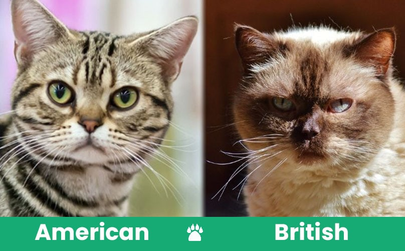

# HW 2 - CS 625, Fall 2023

Maaz Hasnain Khan 
Due: September 20, 2023

## Part 1: Data Cleaning

Following steps were taken to clean the data:

*The steps are explained according to columns*

- #### What Kind of Pet is this? (Dog, Cat, Bird, Other)

    * First, we selected the *'What Kind of Pet is this?'* column and applied Text Facet on it.
    * Then, we fixed some typos, white spaces, capitalization, spelling etc. using text facet.
    * Some breeds and species were mixed up e.g. Lizard / Gecko, which were also corrected.
    * Some assumptions were made. For example, some enteries were incomplete like *'Ca'*, which was assumed to be corrected as cat.

- #### Pet's Full Name (you don't have to include your last name. Think "Winston Churchill" and not "Winston Churchill MYLASTNAME")

    * Secondly, we selected *'Pet's Full Name'* column and applied Text Facet to it as well.
    * Now, we used the cluster attribute and applied different techniques. For example, we fixed typos with fingerprint function, fixed multiple spelling issue with Beider-Morse function.

- #### Pet's everyday name (e.g. "Church")

    * Thirdly, we selected *'Pet's Everyday Name'* column and applied Text Facet on it.
    * Then, we used the cluster attribute and applied different techniques. For example, fixed Typos with Fingerprint function, fixed multiple spelling issue with Beider-Morse fucntion & Multiple Neighbour function.

- #### Pet's Breed

    * Fourthly, we selected the *'Pet's Breed'* column and applied Text Facet.
    * Then, we merged some entries that were separate such as, short haired cats were entered in many different ways.
    * After that, we used the cluster attribute and applied different techniques. For example, fixed Typos with fingerprint function, fixed multiple spelling issue with Cologne Phonetic function.

- #### Pet's Age

    * Moreover, we selected the *'Pet's Age'* column and applied Common Transform to the cells of this column using toNumber function to convert all the strings as numeric values in the column to numbers.
    * Then, apply the Text Facet to the *'Pet's Age'* column, and apply different techniques and functions to merge similar cells.
    * The column of age was really messy, as many people had entered age in years, some in months and others in weeks. We had to assume that the numeric values that didn't contained any string specifying it as years, months or weeks, were years. Then we had to use GREL to clean this column and we removed all the string in this column such as years, months etc using Regex. We also converted all the months into years and ignored the weeks as it wouldn't have helped in answering the questions in part 2.
    * The GREL used to remove the string values year / years is:
        + `if(value.contains('year'), toNumber(value.match(/.*?(\d+\.?\d*).*/)[0]), value)`
    * The GREL used to remove the string values months / mos are:
        + `if(value.toLowercase().contains('month'), ceil(toNumber(value.match(/.*?(\d+\.?\d*).*/)[0]) / 12.00), value)`
        + `if(value.toLowercase().contains('mos'), ceil(toNumber(value.match(/.*?(\d+\.?\d*).*/)[0]) / 12.00), value)`

- #### Other Steps Taken To Clean The Data

    * There were some instances where we had to clean some data manually. This was due to either the complexity of the data or it was too obvious. For example, we had to do some manual cleaning in the breed and kind of pet in some cases as the mixup was really obvious.
    * In the *'What Kind of Pet is this?'* column, there was an entry which contained multiple pets. This entry became complex as the entire row had multiple entries. To tackle this entry, I split one of the columns into multiple rows. What this did however, was it separated only that particular column into multiple rows, but still the other columns had multiple entries so we had to manually fix those.

    

This data was really messy. While cleaning this data we had to make some assumption and had to exclude some entries as they would've caused unnecessary problems.

## Part 2: Analyze Cleaned Data

### *How many types (kinds) of pets are there?*

After cleaning the data it was found that there are approximately 35 kinds of pets. We cannot say their numbers with certainity as there are some pets under *'other'* category.

Some of the entries however, were ignored as they had included robots or virus in the *'What Kind of Pet is this?'* column which did'nt made any sense.

### *How many cats?*

The number of cats is 499.

### *How many breeds of cats?*

There are more than a hundred breeds of cats. Many of the entries in the data are blank therefore, we cannot be sure of their exact number. According to the cleaned data there are almost more than 80 breeds but there are a significant number of entries that are blank. Hence, we come to the conclusion that there are more than a hundred breeds of cats.

### *What's the most popular cat breed? How many cats are in that breed?*

The Domestic Short Hair is the most popular breed. There are around 110 Domestic Short Hair cats in the data.

There were alot of other Short Haired cats entries as well like, American Short Hair or British Short, but upon investigating it was found that these are different from each other. But we also had alot of entries in which Short Haired Cats were not specified as American or British, therefore, we merged all of the Short Haired Cats.

### *What's the age range of the cats?*

There is a wide range of age among the cats. Starting from a few weeks upto 24 years. It is to be noted that the average age of domesticated cats is around 12-20 years. However, in rare cases a cat may live upto around 25-28 years.

### *What's the age range of the rabbits? (Don't forget to look for bunny, too.)*

The age range of rabbits is from upto 1 year to upto 13 years. The average lifespan of domesticated rabbit is around 7-12 years. However, in rare cases a rabbit may live longer than 12 years.

### *What is the oldest pet? Give the pet's name, kind, and age.*

The oldest pet is a cat named Bruce Springsteen who is 24 years old. The breed of that cat is not specified. A cat's average lifespan is upto 20 years, however, in rare cases a cat may live upto 28 years

### *What are the top 5 most popular dog breeds? List the breed and number.*

Following are the top 5 most popular dog breeds:

- Golden Retriever (165)
- Mutt (35)
- Labrador Retriever (25)
- Shih Tzu (22)
- Beagle (19)

There were also some breeds that were mixed. They were kept as separate entries as they were not pure breeds.

### *What's the most popular everyday name for a dog?*

Charlie is the most popular everyday name for a dog. 15 dogs in the list are named Charlie. I'd also like to mention that the second most popular everyday name for a dog is Daisy. 14 dogs are named Daisy in the list. However, the names are prounounced and spelled very differently from each other, so we also have to take this into account.

### *What's the most popular full name any pet?*

The most popular full name of any pet is Sophie. 10 pets have the full name Sophie. However, the names are prounounced and spelled very differently from each other, so we also have to take this into account.

## References

* HW2-petnames CSV File, [HW2-petnames.csv](HW2-petnames.csv)
* HW2-petnames JSON File, [HW2-petnames.json](HW2-petnames.json)
* Wag Walking, <https://wagwalking.com/breed/staffy-bull-pit#:~:text=The%20American%20Staffordshire%20Terrier%20and,written%20as%20such%20that%20some>
* American Kennel Club, <https://www.akc.org/dog-breeds/american-staffordshire-terrier/>
* National Geographic Kids, <https://kids.nationalgeographic.com/animals/reptiles/facts/gecko>
* Dog Time, <https://dogtime.com/dog-breeds/mutt>
* Coops & Cages, <https://www.coopsandcages.com.au/blog/guinea-pig-vs-hamster/#:~:text=Many%20people%20confuse%20Guinea%20Pigs%20and%20Hamsters&text=They%20are%20both%20from%20the,hamsters%20in%20the%20Cricetinae%20genus.>
* Animal Diversity Web, <https://animaldiversity.org/accounts/Abrocomidae/>
* OpenRefine, <https://openrefine.org/docs/manual/grelfunctions>
* YouTube, <https://www.youtube.com/watch?v=OJSRJNF_cHM>
* Stack Overflow, <https://stackoverflow.com/questions/35276841/openrefine-extracting-a-number-from-a-text-column-using-regex>
* Illinois Library, <https://guides.library.illinois.edu/openrefine/grel>
* Reproducibility Immersive Course, <https://vickysteeves.gitlab.io/2018-uutah-repro/>
* Excited Cats, <https://excitedcats.com/american-shorthair-cat-vs-british-shorthair-cat/>
* Cat Care for Life, <https://www.catcare4life.org/cat-owners/lifestages/#:~:text=The%20average%20lifespan%20for%20a,or%2030%20years%20of%20age.>
* Blue Cross, <https://www.bluecross.org.uk/advice/rabbit/wellbeing-and-care/how-long-do-rabbits-live>