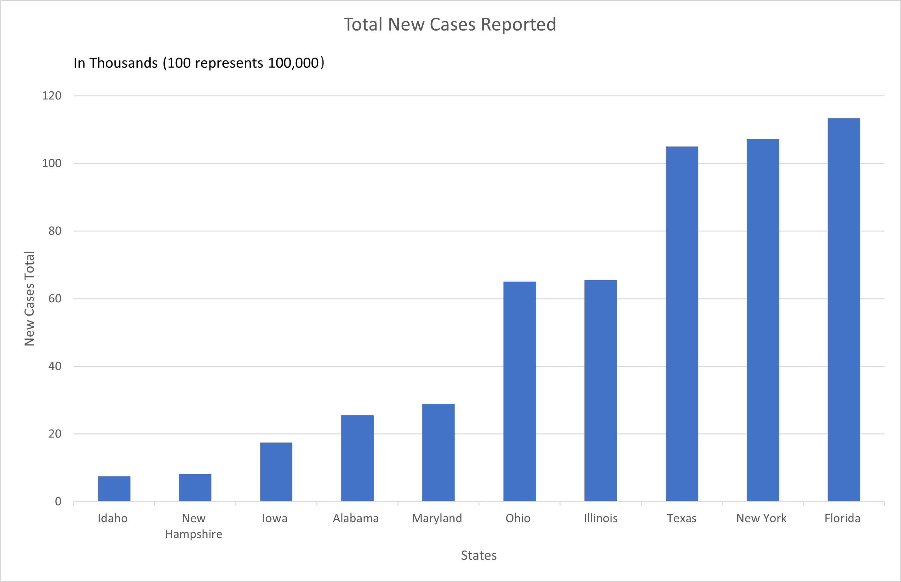

# HW 3 - CS 625, Fall 2023

Maaz Hasnain Khan 

Due: October 4, 2023

##  First Data

- The first data set is from Table 183 Section 3 Health Conditions, Diseases

    [Cancer--Estimated New Cases and Deaths by State](https://www2.census.gov/library/publications/2011/compendia/statab/131ed/tables/12s0183.xls)

### Data Wrangling

First, we used Open Refine to clean the data and get rid of any unnecessary headers and footers in the *.xls* file and converted it into a *.csv* file. There wasn't much wrong with the data, therefore, there was not much data to be cleaned. After getting the *.csv* file, we used Python to further manipulate and process the data. This was a complex process, hence, will be discussed in points:

#### For Bar Chart
* First, we mount Google Drive to access files and then read a CSV file named *"Cancer-Data-Cleaned.csv"* into a Pandas DataFrame.
* Then, we remove the first row (index 0) from the DataFrame.
* After that, we randomly select 10 rows from the DataFrame as a subset.
* Then, we create a new DataFrame named *'cancer_data_state'* that contains only the *'State'* and *'New cases Total'* columns from the subset.
* Then, we sort the *'cancer_data_state'* DataFrame based on the *'New cases Total'* column in ascending order.
* Finally, we create a bar plot using the Seaborn library. The plot displays the 'State' on the x-axis and 'New cases Total' on the y-axis, with additional text annotations. The plot is formatted with specific dimensions and ticks for the axes.

#### For Scatter Plot
* First, we mount Google Drive to access files and read a CSV file named *"Cancer-Data-Cleaned.csv"* from Google Drive into a Pandas DataFrame called *'cancer_data'*.
* Then, we remove the first row (index 0) from the *'cancer_data'* DataFrame, resulting in a DataFrame called *'cases_death_cancer_data'*.
* After that, we randomly select 25 rows from the *'cases_death_cancer_data'* DataFrame to create a subset, which is stored in a new DataFrame called *'cases_death_cancer_data_25'*.
* Then, we create a scatterplot (dot plot) using the Seaborn library. The plot displays *'New cases Total'* on the x-axis and *'Deaths Total'* on the y-axis, with each dot colored based on the *'State'* column.
* Finally, we format the plot with a specified size, adjust the size and appearance of the dots, and set ticks on the axes for better readability.

##### Note:
The charts in the report and Google Colab might be different as we have used data in random form. For the bar chart, we have used data from 10 random States and similarly, for scatter plot, we have used data from 25 random states. So, upon running the code again the chart might come out different than the original one.

##  Second Data
- The second data set is from Table 181 Section 3 Health Conditions, Diseases

    [Organ Transplant](https://www2.census.gov/library/publications/2011/compendia/statab/131ed/tables/12s0181.xls)

### Data Wrangling

First, we used Open Refine to clean the data and get rid of any unnecessary headers and footers in the *.xls* file and converted it into a *.csv* file. Then we extracted the two columns *'Procedure'* and *'Number of Procedures'* as only these columns were required for plotting the Multiple Line Chart. After getting the *.csv* file, we used Python to further manipulate and process the data. This was a complex process, hence, will be discussed in points:

#### For Multiple Line Chart:

* First, we read a CSV file named *"Organ-Transplant.csv"* into a Pandas DataFrame called organ_data. Then, transpose the DataFrame using *.T* to make years the index and set the index name to *'Year'*.
* Then, we create a cleaned DataFrame called cleaned_organ_data by dropping the *'Procedure'* row from *'organ_data'*. Then, set up the figure and style for the Seaborn plot. Define line styles, line colors, and legend labels.
* After that, we loop through the legend labels, line colors, and line styles, and for each organ type:
    + Use Seaborn's lineplot to plot the data for that organ type with the specified label, color, and line style.
* Then, add labels to the x-axis and y-axis and, set a title for the plot and, create legend elements based on the legend labels, line colors, and line styles.
* Finally, we display the legend using *'plt.legend()'* and finally, show the plot using *'plt.show()'*

## Visualization Idioms

### Bar Chart

A bar chart is a suitable choice when you want to compare discrete categories (in this case, U.S. states) and their corresponding values (New Cases). Bar charts allow for easy visual comparison between categories and are particularly useful for showing differences in quantities.

I used a bar chart to represent the New Cases data for different U.S. states. Each state is a distinct category, and the height of each bar represents the number of new cancer cases in that state. This choice allows viewers to quickly see which states have the highest and lowest numbers of new cases, making it effective for comparing states' cancer incidence.

Idiom: Bar Chart / Mark: Line
| Data: Attribute | Data: Attribute Type  | Encode: Channel | 
| --- |---| --- |
| State Name | Key, Categorical | Vertical Spatial Region (x-axis) |
| New Cases | Value, Quantitative | Horizontal Position on a Common Scale (y-axis) |

### Scatter Plot

A scatter plot is appropriate when you want to explore the relationship or correlation between two continuous variables (New Cases and Total Deaths) for different categories (U.S. states). Scatter plots allow you to identify patterns, trends, or clusters in data points.

I used a scatter plot to visualize the relationship between the number of New Cases and Total Deaths for different U.S. states. Each data point represents a state, with the y-axis showing the number of New Cases and the x-axis showing the Total Deaths. This choice allows viewers to assess if there is a correlation between the number of new cancer cases and the total number of deaths, helping to identify states where the impact of cancer may be more severe or less severe based on these two variables.

Idiom: Scatter Plot / Mark: Dots
| Data: Attribute | Data: Attribute Type  | Encode: Channel | 
| --- |---| --- |
| State Name | Key, Categorical | Color (Third Channel) |
| New Cases | Value, Quantitative | Horizontal Position on a Common Scale (x-axis) |
| Total Deaths  | Value, Quantitative | Vertical Spatial Region (y-axis) |

### Multiple Line Chart

A multiple line chart is well-suited for representing time series data, where the dataset includes a temporal component. In this case, the dataset contains years, indicating a time-based dataset. This dataset contains several different types of organ transplant procedures (e.g., heart transplant, kidney transplant). Using a multiple line chart allows for a simultaneous comparison of these different categories over time.

A multiple line chart for this organ transplant dataset is appropriate because it effectively conveys the changes in the number of procedures for different organ types over time. It allows for easy comparison between categories and helps viewers identify trends and patterns in the data, making it a valuable visualization for understanding the dynamics of organ transplant procedures.

Idiom: Multiple Line Chart / Mark: Line
| Data: Attribute | Data: Attribute Type  | Encode: Channel | 
| --- |---| --- |
| Year | Key, Categorical | Horizontal Position (X-axis) |
| Number of Procedures | Value, Quantitative | Vertical Position (Y-axis) |
| Procedure Type | Key, Categorical | Line (Third Channel) |

## Creating Charts

### Python Seaborn (Google Colab)

[Python Seaborn Google Colab Link Click Here](https://colab.research.google.com/drive/1UxMiY20it_1Xdh4Mt9IV2-k6mYPyUJRu?usp=sharing)

##### Note:
The charts in the report and Google Colab might be different as we have used data in random form. For the bar chart, we have used data from 10 random States and similarly, for scatter plot, we have used data from 25 random states. So, upon running the code again the chart might come out different than the original one.

#### Bar Chart


###### Code

```
import pandas as pd
from pandas import DataFrame
from google.colab import drive
import seaborn.objects as so
import seaborn as sns
import matplotlib.pyplot as plt
from seaborn import axes_style

drive.mount("/content/drive", force_remount = True)
cancer_data = pd.read_csv("/content/drive/MyDrive/CS_625_HW3/Cancer-Data-Cleaned.csv")

cancer_data_wo_us = cancer_data.drop(0, axis=0)
cancer_data_10_samples = cancer_data_wo_us.sample(10)
cancer_data_state = cancer_data_10_samples.iloc[:,[0,1]]

cancer_data_state= cancer_data_state.sort_values(by=['New cases Total'])

(
    so.Plot(data=cancer_data_state, x='State', y='New cases Total').layout(size=(15, 6))
    .add(so.Bar())
    .theme({**axes_style("ticks")})
    .add(so.Text(halign="left"))
    .plot()
)
```

#### Scatter Plot


###### Code

```
import pandas as pd
from pandas import DataFrame
from google.colab import drive
import seaborn.objects as so
import seaborn as sns
import matplotlib.pyplot as plt
from seaborn import axes_style

drive.mount("/content/drive", force_remount = True)
cancer_data = pd.read_csv("/content/drive/MyDrive/CS_625_HW3/Cancer-Data-Cleaned.csv")
cases_death_cancer_data = cancer_data.drop(0, axis=0)
cases_death_cancer_data_25 = cases_death_cancer_data.sample(25)
(
    so.Plot(data=cases_death_cancer_data_25,
    x='New cases Total',
    y='Deaths Total',
    color='State',).layout(size=(10, 6))
    .add(so.Dots(pointsize=15,fillcolor="white", stroke=2.5))
    .theme({**axes_style("ticks")})
)
```

#### Multiple Line Chart


###### Code

```
from matplotlib.lines import Line2D
import pandas as pd
from pandas import DataFrame
from google.colab import drive
import seaborn.objects as so
import seaborn as sns
import matplotlib.pyplot as plt
from seaborn import axes_style

organ_data = pd.read_csv("/content/drive/MyDrive/CS_625_HW3/Organ-Transplant.csv")
organ_data = organ_data.T
organ_data.index.name = 'Year'

cleaned_organ_data = organ_data.drop('Procedure', axis=0)

plt.figure(figsize=(12, 6))
sns.set(style="whitegrid")

line_styles = ['-', '-', '-', '-', '-', '-', '-', '-']
line_colors = ['blue', 'green', 'red', 'purple', 'orange', 'brown', 'pink', 'gray']

legend_labels = ["Heart", "Heart & Lung", "Lung", "Liver",
                 "Kidney", "Kidney & Pancreas", "Pancreas", "Intestine"]

for i, (label, color, style) in enumerate(zip(legend_labels, line_colors, line_styles)):
    sns.lineplot(data=cleaned_organ_data[i], label=label, color=color, linestyle=style)

plt.xlabel("Year")
plt.ylabel("Number of Procedures")
plt.title("Organ Transplants Over the Years")

legend_elements = [
    Line2D([0], [0], color=color, linestyle=style, label=label)
    for label, color, style in zip(legend_labels, line_colors, line_styles)
]

plt.legend(handles=legend_elements)

plt.show()
```

### Excel

[Cancer-Data-Cleaned.xlsx](Cancer-Data-Cleaned.xlsx)

#### Bar Chart



Below is the table used in making the above bar chart in Excel.

| State          | New Cases Total |
|----------------|-----------------|
| Idaho          | 7.52            |
| New Hampshire  | 8.21            |
| Iowa           | 17.5            |
| Alabama        | 25.53           |
| Maryland       | 28.89           |
| Ohio           | 65.06           |
| Illinois       | 65.61           |
| Texas          | 105             |
| New York       | 107.26          |
| Florida        | 113.4           |

## Reflection

Personally, for me, plotting the chart in Excel was easy. This might be due to my non-CS background as I faced many challenges while working with Seaborn. However, this dataset was simple and there was not much to be cleaned, this might also be one of the reasons Excel seemed easy. In my opinion, if the dataset is simple and small Excel might prove to be the winner, however,  if advanced customization, automation, or working on data analysis tasks is required, Python would provide more flexibility and control, although it may require more initial effort to learn and set up.

## References

* First Data Set CSV File, [Cancer-Data-Cleaned.csv](Cancer-Data-Cleaned.csv)
* Second Data Set CSV File, [Organ-Transplant-Cleaned.csv](Organ-Transplant-Cleaned.csv)
* First Data Set Raw File, [Cancer-Data-Raw.xls](Cancer-Data-Raw.xls)
* Second Data Set Raw File, [Organ-Transplant-Raw.xls](Organ-Transplant-Data-Raw.xls)
* Google Colab Jupyter Source File, [CS_625_HW3.ipynb](CS_625_HW3.ipynb)
* Bar Chart in Excel XLSX File, [Cancer-Data-Cleaned.xlsx](Cancer-Data-Cleaned.xlsx)
* PyData (Seaborn), <https://seaborn.pydata.org/generated/seaborn.objects.Dot.html>
* PyData (Pandas),<https://pandas.pydata.org/docs/reference/api/pandas.DataFrame.sort_values.html>
* Markdown Guide, <https://www.markdownguide.org/basic-syntax/#links>
* From Data to Viz, <https://www.data-to-viz.com/graph/barplot.html#:~:text=Definition,bar%20represents%20its%20numeric%20value.>
* Visme, <https://visme.co/blog/scatter-plot/>
* Python Charts, <https://python-charts.com/seaborn/grid/>
* Anaconda, <https://anaconda.cloud/seaborn-objects-system>
* Github, <https://github.com/mwaskom/seaborn/issues/3146>
* SaturnCloud, <https://saturncloud.io/blog/adding-text-relative-to-axes-in-seaborn-and-matplotlib-a-guide/>
* Stackoverflow, <https://stackoverflow.com/questions/41511334/adding-text-to-each-subplot-in-seaborn>
* United States Census Bureau, <https://www.census.gov/library/publications/2011/compendia/statab/131ed.html>