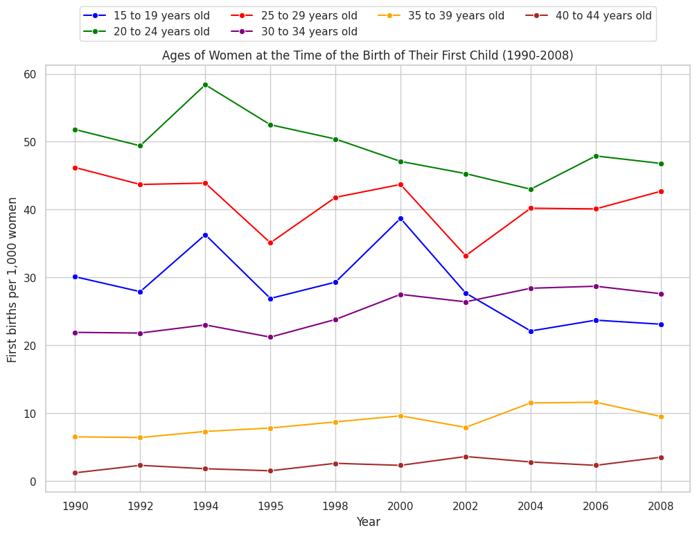

# HW 4 - CS 625, Fall 2023

Maaz Hasnain Khan 

Due: October 25, 2023

### NOTE:
It has to be noted that the data was cleaned before plotting of charts and only meaningful data was extracted from each dataset for specific questions. The cleaned data are located in separate files named with the dataset and question number.

## Dataset 1

Table 91 - Women Who Have Had a Child in the Last Year by Age

**Q1:** Compare the ages of women at the time of the birth of their first child between 1990-2008. For instance, is there any evidence that women in the US are waiting longer to have their first child?

**15 to 19 years old:** The number of women in this age group giving birth decreased from 30,100 in 1990 to 23,100 in 2008, signifying a significant decline. This suggests that women in this age group are waiting longer to have their first child.

**20 to 24 years old:** In 1990, 51,800 women in this age group gave birth, which reduced to 46,800 in 2008. This indicates a decrease in the number of women in this age group having their first child, suggesting a trend of waiting longer.

**25 to 29 years old:** The data shows that the number of women giving birth in this age group slightly decreased from 46,200 in 1990 to 42,700 in 2008, implying that some women in this age group may be waiting longer to have their first child.

**30 to 34 years old:** In 1990, 21,900 women in this age group gave birth, and in 2008, the number increased to 27,600. This suggests an increase in the number of women in this age group having their first child, indicating a mixed trend of waiting longer.

**35 to 39 years old:** The number of women giving birth in this age group increased from 6,500 in 1990 to 9,500 in 2008, indicating a trend of waiting longer to have the first child within this age group.

**40 to 44 years old:** In 1990, 1,200 women in this age group gave birth, and in 2008, this increased to 3,500. This signifies that more women in this age group are having their first child, suggesting a shift towards later first childbirth in this age group.

The analysis of the data indicates that women in the United States were, on average, waiting longer to have their first child between 1990 and 2008, particularly in the younger age groups (15 to 24). There is evidence of a decrease in the number of younger women having their first child, while the older age groups (35 to 44) show an increase, implying a shift in childbirth trends towards later ages in some cases.

**Q2:** How does this compare to the number of women in each age group who had a child (not necessarily their first) in that year? What does this say about the age of women giving birth in the US?

**Further Questions:** What further questions does this prompt?  What hypotheses do you have about what the answers might be?  Are there other tables that might help you address these questions?  

**Extra Credit [2 points]:** Combine the data from Tables 91 and 92 (Women Who Have Had a Child in the Last Year By Selected Characteristics) to investigate other factors that affect this.

## References

* First DataSet CSV File, [dataset_1.csv](dataset_1.csv)
* Second Data Set CSV File, [Organ-Transplant-Cleaned.csv](Organ-Transplant-Cleaned.csv)
* First Data Set Raw File, [Cancer-Data-Raw.xls](Cancer-Data-Raw.xls)
* Second Data Set Raw File, [Organ-Transplant-Raw.xls](Organ-Transplant-Data-Raw.xls)
* Google Colab Jupyter Source File, [CS_625_HW3.ipynb](CS_625_HW3.ipynb)
* Bar Chart in Excel XLSX File, [Cancer-Data-Cleaned.xlsx](Cancer-Data-Cleaned.xlsx)
* PyData (Seaborn), <https://seaborn.pydata.org/generated/seaborn.objects.Dot.html>
* PyData (Pandas),<https://pandas.pydata.org/docs/reference/api/pandas.DataFrame.sort_values.html>
* Markdown Guide, <https://www.markdownguide.org/basic-syntax/#links>
* From Data to Viz, <https://www.data-to-viz.com/graph/barplot.html#:~:text=Definition,bar%20represents%20its%20numeric%20value.>
* Visme, <https://visme.co/blog/scatter-plot/>
* Python Charts, <https://python-charts.com/seaborn/grid/>
* Anaconda, <https://anaconda.cloud/seaborn-objects-system>
* Github, <https://github.com/mwaskom/seaborn/issues/3146>
* SaturnCloud, <https://saturncloud.io/blog/adding-text-relative-to-axes-in-seaborn-and-matplotlib-a-guide/>
* Stackoverflow, <https://stackoverflow.com/questions/41511334/adding-text-to-each-subplot-in-seaborn>
* United States Census Bureau, <https://www.census.gov/library/publications/2011/compendia/statab/131ed.html>