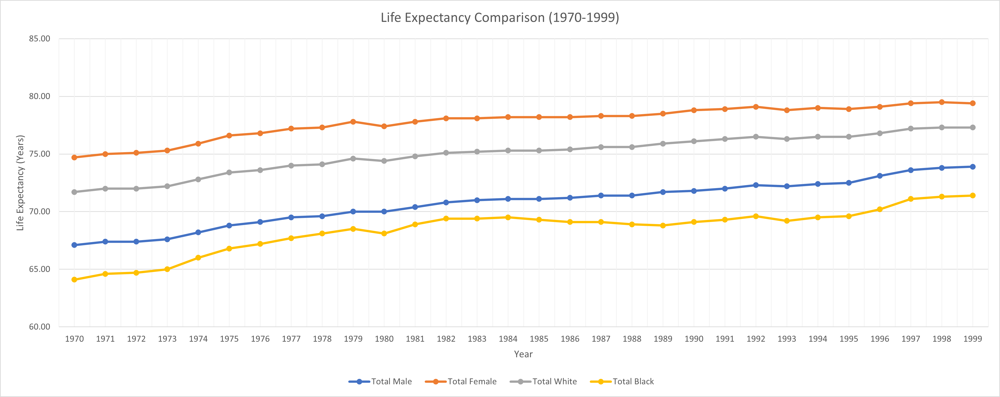
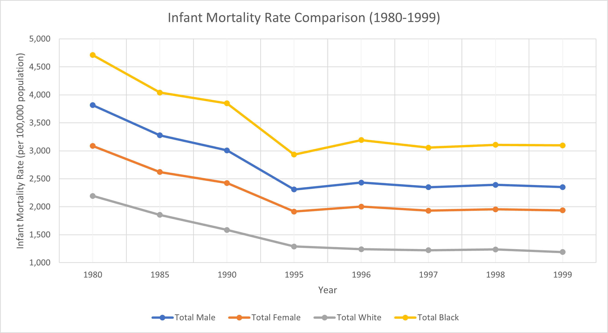
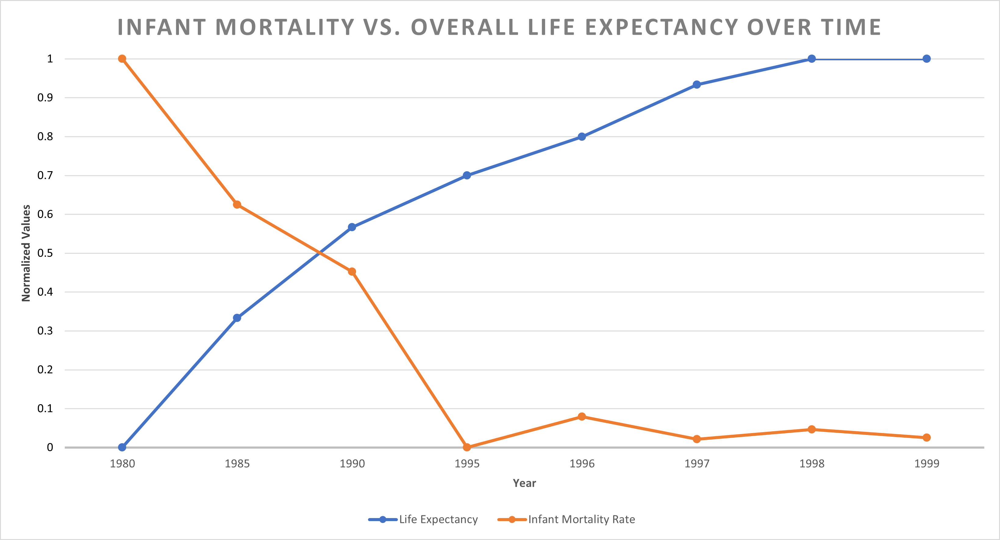
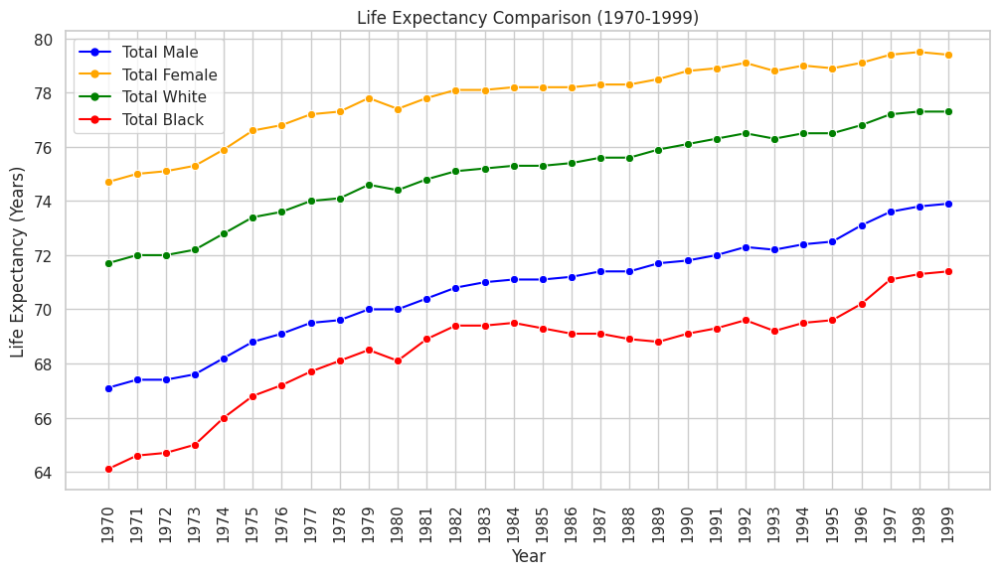
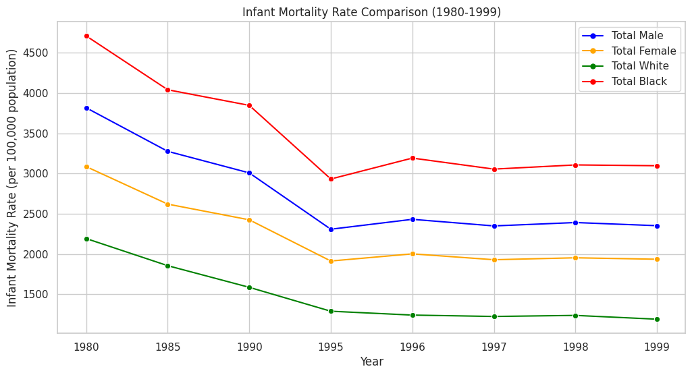

# HW 4 - CS 625, Fall 2023

Maaz Hasnain Khan 

Due: October 25, 2023

#### NOTE:
It has to be noted that the data was cleaned before plotting of charts and only meaningful data was extracted from each dataset for specific questions. The cleaned data are located in separate files named with the dataset and question number.

## Dataset 3

### Question 1:

**Using Table 102, compare life expectancy for people born between 1970-1999 for the four categories, "Male", "Female", "White", "Black".**

Table 102 - Expectation of Life at Birth, and Projections



The line chart effectively illustrates how life expectancy has changed between 1970 and 1999 for various demographic categories: "Total Male," "Total Female," "Total White," and "Total Black." The chart primarily highlights the overall trends in life expectancy within this 30-year timeframe. A line chart is a suitable choice for this data because it effectively displays the changes in life expectancy for individuals born between 1970 and 1999, allowing for clear comparisons between different categories.

Idiom: Multiple Line Chart / Mark: Dots
| Data: Attribute | Data: Attribute Type  | Encode: Channel | 
| --- |---| --- |
| Year | Key, Temporal | Horizontal Position (X-axis) |
| Life Expectancy (Years) | Value, Quantitative | Vertical Position (Y-axis) |
| Sex/Race | Key, Categorical | Color Hue (Third Channel) |

To create this chart, we didn't really had to clean or manipulate the data as the raw data file was good enough. We just simply created the chart in Excel after selecting the required columns.

The x-axis denotes the years, spanning from 1970 to 1999, facilitating a temporal analysis. On the y-axis, life expectancy is represented, offering insight into the average expected age at birth for individuals in each of the specified categories.

The chart's key findings are as follows:

- "Total Female" consistently exhibits higher life expectancy compared to "Total Male," indicating that, on average, females tend to live longer than males.

- "Total White" generally demonstrates a higher life expectancy than "Total Black," reflecting disparities in life expectancy along racial lines.

- The chart reveals the variations in life expectancy from year to year. It shows a constant upward trend as the years go by indicating the increase in life expectancy for all demographics. This maybe due to several factors including betterment of the healthcare facilities and modern medicine.

In conclusion, the chart effectively presents the changing trends in life expectancy over a 30-year period, offering valuable insights into the differences among demographic groups and changes in life expectancy during this time frame.

**The Excel File for this chart, [dataset3_q1_excel.xlsx](dataset3_q1_excel.xlsx)**

### Question 2:

**Using Table 107, compare infant mortality rates (under 1 year) for these same categories between 1980-1999.**

Table 107 - Death Rates by Age, Sex, and Race



The line chart created displays the trends in infant mortality rates for different categories between the years 1980 and 1999. The categories represented in the chart are 'Total Male,' 'Total Female,' 'Total White,' and 'Total Black.' The infant mortality rates are presented in terms of deaths per 100,000 population.  A line chart is a suitable choice for this data because it effectively displays the changes in mortality rates for infants born between 1980 and 1999, allowing for clear comparisons between different categories.

Idiom: Multiple Line Chart / Mark: Dots
| Data: Attribute | Data: Attribute Type  | Encode: Channel | 
| --- |---| --- |
| Year | Key, Temporal | Horizontal Position (X-axis) |
| Infant Mortality Rate (per 100,000 population) | Value, Quantitative | Vertical Position (Y-axis) |
| Sex/Race | Key, Categorical | Color Hue (Third Channel) |

To create this chart, we had to manipulate and normalize the data. We did so in excel simply. The raw data contained total white male & female and total black male & female death rates for different years. We simply used the *sum* formula in excel to create the total male, total female, total white and total black columns.

The x-axis of the chart represents the years from 1980 to 1999. While the y-axis represents the infant mortality rate. This rate is calculated as the number of infant deaths per 100,000 population within each category.

The chart's key findings are as follows:

- The chart shows a general trend of decreasing infant mortality rates across all categories over the two decades. This is a positive outcome and suggests improvements in healthcare and public health efforts during this period.

- There is a consistent difference in infant mortality rates between males and females. In all years, the infant mortality rate for males is higher than that for females. This suggests that male infants had a higher risk of mortality during this period.

- The chart also highlights significant disparities in infant mortality rates between different racial groups, specifically White and Black. Black infants consistently had a higher infant mortality rate compared to White infants. This racial disparity is a cause for concern and may indicate disparities in healthcare access and quality.

In conclusion, the chart illustrates a positive overall trend of decreasing infant mortality rates from 1980 to 1999. However, it also highlights disparities based on gender and race, with males and Black infants experiencing higher mortality rates.

#### NOTE:

I saw the Q/A cafe discussion in canvas after plotting this chart. I have used the same categories for question 2 which I used in question 1 as was mentioned in the instruction.

**The Excel File for this chart, [dataset3_q2_excel.xlsx](dataset3_q2_excel.xlsx)**

### Further Questions:

**What further questions does this prompt?  What hypotheses do you have about what the answers might be?  Are there other tables that might help you address these questions?**

***Question:*** Why have life expectancy and infant mortality rates changed over time? What factors have contributed to these changes?

***Hypotheses:*** Improved healthcare, advancements in medical technology, and public health initiatives likely contributed to increased life expectancy and decreased infant mortality. To test this hypothesis, we would need data on healthcare infrastructure and accessibility, medical advancements, public health policies and interventions, and how they have evolved over time.

***Question:*** Are there regional variations in life expectancy and infant mortality within the United States? Do certain regions show different trends?

***Hypotheses:*** Regions with better access to healthcare and more robust public health systems may exhibit higher life expectancy and lower infant mortality. To investigate  this hypothesis, you would need regional or state-level data on healthcare infrastructure, public health expenditures, and the availability of healthcare facilities.

### Extra Credit [2 Points]

**Combine the data from Tables 102 and 107 to investigate how infant mortality might affect overall life expectancy.**

Table 102 - Expectation of Life at Birth, and Projections

Table 107 - Death Rates by Age, Sex, and Race



The dual axis line chart is ideal for this analysis, as it enables the concurrent visualization of two related but distinct datasets: life expectancy and infant mortality rate. This format allows for an efficient examination of potential correlations between these two factors over time. The chart displays the normalized trends of both life expectancy and infant mortality rate from 1980 to 1999. The blue line represents the trend in normalized life expectancy. The red line represents the trend in normalized infant mortality rate.

Idiom: Dual Axis Line Chart / Mark: Dots
| Data: Attribute | Data: Attribute Type  | Encode: Channel | 
| --- |---| --- |
| Year | Key, Temporal | Horizontal Position (X-axis) |
| Infant Mortality Normalized | Value, Quantitative | Vertical Position (Y-axis Right) |
| Life Expectancy Normalized | Value, Quantitative | Vertical Position (Y-axis Left) |
| Life Expectancy/Infant Mortality | Key, Categorical | Color Hue (Third Channel) |

The chart's key findings are as follows:

- If infant mortality rates are high, it may have a negative impact on life expectancy, which could be observed as a decrease in life expectancy.

- Conversely, as infant mortality rates decrease, life expectancy tends to increase.

- The chart demonstrates a general trend of improving life expectancy and decreasing infant mortality rates from 1980 to 1999.

The dual axis line chart is instrumental in analyzing how changes in infant mortality may correspond to changes in overall population health and life expectancy, highlighting the importance of reducing infant mortality for the well-being of a population.

The data was manipulated using python. The life expectancy and infant mortality rate data were 2 separate data which were merged using python. The data was normalized on a similar scale as both values were in different units. The life expectancy was in years while the infant mortality rate was per 100,000 population. These values were normalized were brought in range from ***'0-1'***, with ***'0'*** being the lowest value and ***'1'*** being the highest value.

The data after normalizing was extracted from google colab and used in MS Excel to create the chart.

##### Data Manipulation Code

```

drive.mount("/content/drive", force_remount=True)
life_expectancy_data = pd.read_csv("/content/drive/MyDrive/CS_625_HW4/dataset3_q1.csv")
mortality_data = pd.read_csv("/content/drive/MyDrive/CS_625_HW4/dataset3_q2.csv")

merged_data = pd.merge(life_expectancy_data, mortality_data, on='Year')
merged_data['Year'] = merged_data['Year'].astype(int).astype(str)

def scale_data(data):
    min_data = min(data)
    max_data = max(data)
    return [(x - min_data) / (max_data - min_data) for x in data]

scaled_life_expectancy = scale_data(merged_data['Total_x'])
scaled_mortality_rate = scale_data(merged_data['Total_y'])

```

**The Excel File for the normalized data is, [dataset3_normalized_data.csv](dataset3_normalized_data.csv)**

##### Explanation

The datasets were merged based on the 'Year' column and converted to string data type to combine the relevant information. A custom scaling function (scale_data) is defined to normalize the data. Normalization scales the data to a common range ***'0-1'***, making it easier to compare two different datasets with different units and scales.

**The Excel File for this chart, [dataset3_ec_excel.xlsx](dataset3_ec_excel.xlsx)**

### [4 points] Re-create the charts you created for your chosen dataset using Python or Vega-Lite.

**Using Table 102, compare life expectancy for people born between 1970-1999 for the four categories, "Male", "Female", "White", "Black".**



##### Code

```

import pandas as pd
import seaborn as sns
import matplotlib.pyplot as plt
from google.colab import drive
from matplotlib.lines import Line2D

drive.mount("/content/drive", force_remount=True)
life_data = pd.read_csv("/content/drive/MyDrive/CS_625_HW4/dataset3_q1.csv")

grouped_data = life_data.groupby('Year').mean().reset_index()

sns.set(style="whitegrid")

plt.figure(figsize=(12, 6))

categories = ['Total Male', 'Total Female', 'Total White', 'Total Black']
colors = ['blue', 'orange', 'green', 'red']

legend_elements = []

for category, color in zip(categories, colors):
    line = sns.lineplot(data=grouped_data, x='Year', y=category, label=category, color=color, marker='o')

    legend_elements.append(Line2D([0], [0], color=color, label=category, marker='o', markersize=5))

plt.xlabel("Year")
plt.ylabel("Life Expectancy (Years)")
plt.title("Life Expectancy Comparison (1970-1999)")

plt.legend(handles=legend_elements)

plt.xticks(grouped_data['Year'], rotation=90)

plt.show()

```

**The CSV File for this chart is, [dataset3_q1.csv](dataset3_q1.csv)** 

##### Explanation

The dataset is read into a Pandas DataFrame and grouped by year, calculating the mean life expectancy values for each category per year. This grouping allows for a more structured analysis of how life expectancy has changed over time for different demographic groups.

The line chart is created with Seaborn and Matplotlib, featuring categories with distinct colors: "Total Male" (blue), "Total Female" (orange), "Total White" (green), and "Total Black" (red). The chart visually conveys the life expectancy trends over the years, emphasizing the variations in life expectancy for these different categories. Each category is represented by a line connecting data points, and markers indicate specific data points for each year.

The custom legend is added to the chart, enhancing its readability by associating each line with its category label and marker. The x-axis labels are rotated for better visibility, and labels for the x-axis, y-axis, and the chart title are included to provide context for the data.

**Using Table 107, compare infant mortality rates (under 1 year) for these same categories between 1980-1999.**



##### Code

```

import pandas as pd
import seaborn as sns
import matplotlib.pyplot as plt
from google.colab import drive

drive.mount("/content/drive", force_remount=True)

deaths_data = pd.read_csv("/content/drive/MyDrive/CS_625_HW4/dataset3_q2.csv")

deaths_data['Year'] = deaths_data['Year'].astype(int).astype(str)

sns.set(style="whitegrid")

plt.figure(figsize=(12, 6))

categories = ['Total Male', 'Total Female', 'Total White', 'Total Black']
colors = ['blue', 'orange', 'green', 'red']

legend_elements = []

for category, color in zip(categories, colors):
    sns.lineplot(data=deaths_data, x='Year', y=category, label=category, color=color, marker='o')

    legend_elements.append(plt.Line2D([0], [0], color=color, label=category, marker='o', markersize=5))

plt.xlabel("Year")
plt.ylabel("Infant Mortality Rate (per 100,000 population)")
plt.title("Infant Mortality Rate Comparison (1980-1999)")

plt.legend(handles=legend_elements)

plt.show()


```

**The CSV File for this chart is, [dataset3_q2.csv](dataset3_q2.csv)** 

##### Explanation

The dataset is read into a Pandas DataFrame and the 'Year' column is converted to strings to ensure proper formatting and interpretation.

The style of the chart is set using Seaborn, which creates a white grid background, contributing to the chart's clarity. Matplotlib is employed to define the dimensions of the chart, ensuring that it is appropriately sized for viewing and analysis.

Distinct categories, including "Total Male," "Total Female," "Total White," and "Total Black," are assigned specific colors for easy differentiation. The code creates custom legend elements that are associated with lines and markers, enhancing the chart's readability and interpretability. A loop is used to plot the infant mortality rates for each category, creating lines that connect data points for each year, with markers highlighting specific data points.

## References

* First DataSet CSV File, [dataset_1.csv](dataset_1.csv)
* Second Data Set CSV File, [Organ-Transplant-Cleaned.csv](Organ-Transplant-Cleaned.csv)
* First Data Set Raw File, [Cancer-Data-Raw.xls](Cancer-Data-Raw.xls)
* Second Data Set Raw File, [Organ-Transplant-Raw.xls](Organ-Transplant-Data-Raw.xls)
* Google Colab Jupyter Source File, [CS_625_HW3.ipynb](CS_625_HW3.ipynb)
* Bar Chart in Excel XLSX File, [Cancer-Data-Cleaned.xlsx](Cancer-Data-Cleaned.xlsx)
* PyData (Seaborn), <https://seaborn.pydata.org/generated/seaborn.objects.Dot.html>
* PyData (Pandas),<https://pandas.pydata.org/docs/reference/api/pandas.DataFrame.sort_values.html>
* Markdown Guide, <https://www.markdownguide.org/basic-syntax/#links>
* From Data to Viz, <https://www.data-to-viz.com/graph/barplot.html#:~:text=Definition,bar%20represents%20its%20numeric%20value.>
* Visme, <https://visme.co/blog/scatter-plot/>
* Python Charts, <https://python-charts.com/seaborn/grid/>
* Anaconda, <https://anaconda.cloud/seaborn-objects-system>
* Github, <https://github.com/mwaskom/seaborn/issues/3146>
* SaturnCloud, <https://saturncloud.io/blog/adding-text-relative-to-axes-in-seaborn-and-matplotlib-a-guide/>
* Stackoverflow, <https://stackoverflow.com/questions/41511334/adding-text-to-each-subplot-in-seaborn>
* United States Census Bureau, <https://www.census.gov/library/publications/2011/compendia/statab/131ed.html>
https://stackoverflow.com/questions/76644454/is-there-an-alternate-for-palette-while-plotting-barplot-through-seaborn-objec
https://stackoverflow.com/questions/74715767/how-to-rotate-the-xticks-with-seaborn-objects
https://stackoverflow.com/questions/53694724/how-to-prevent-matplotlib-from-showing-decimal-years-in-horizontal-axis

***SECOND CHART USING SEABORN***
The provided Python code generates a line chart that serves as a visual representation for comparing infant mortality rates across various demographic categories from the years 1980 to 1999. The data used in this analysis is sourced from a dataset stored in a Google Drive file named "dataset3_q2.csv." The code leverages Python libraries, including Pandas, Seaborn, Matplotlib, and Google Colab, to read the data, manipulate it, and create the visual chart.

The initial steps involve mounting Google Drive to access the dataset, and then reading this data into a Pandas DataFrame, which is named deaths_data. To facilitate the subsequent visualization, the 'Year' column is converted to strings to ensure proper formatting and interpretation.

The style of the chart is set using Seaborn, which creates a white grid background, contributing to the chart's clarity. Matplotlib is employed to define the dimensions of the chart, ensuring that it is appropriately sized for viewing and analysis.

Distinct categories, including "Total Male," "Total Female," "Total White," and "Total Black," are assigned specific colors for easy differentiation. The code creates custom legend elements that are associated with lines and markers, enhancing the chart's readability and interpretability. A loop is used to plot the infant mortality rates for each category, creating lines that connect data points for each year, with markers highlighting specific data points.

To provide context for the chart, labels are added for the x-axis (representing the years), y-axis (reflecting the infant mortality rate per 100,000 population), and the chart's title. Additionally, a custom legend is included to identify each line with its corresponding category label and marker, simplifying the interpretation of the chart.