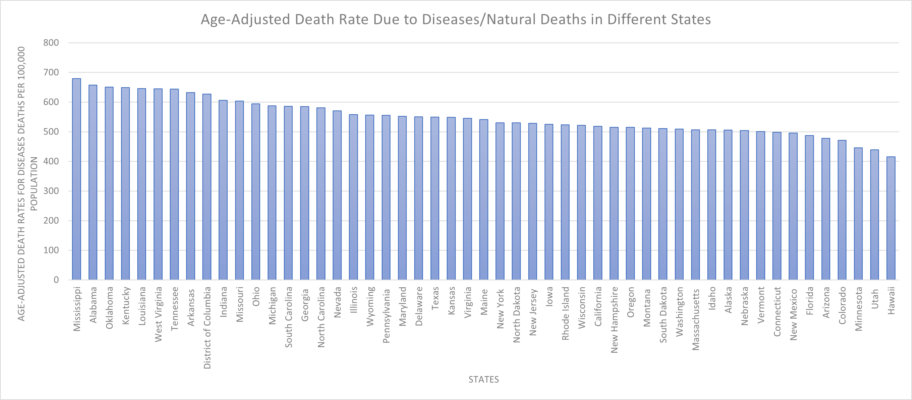

# HW 4 - CS 625, Fall 2023

Maaz Hasnain Khan 

Due: October 25, 2023

#### NOTE:
It has to be noted that the data was cleaned before plotting of charts and only meaningful data was extracted from each dataset for specific questions. The cleaned data are located in separate files named with the dataset and question number.

## Dataset 3

### Question 1:

**Using Table 102, compare life expectancy for people born between 1970-1999 for the four categories, "Male", "Female", "White", "Black".**

Table 102 - Expectation of Life at Birth, and Projections


The line chart effectively illustrates how life expectancy has changed between 1970 and 1999 for various demographic categories: "Total Male," "Total Female," "Total White," and "Total Black." The chart primarily highlights the overall trends in life expectancy within this 30-year timeframe. A line chart is a suitable choice for this data because it effectively displays the changes in life expectancy for individuals born between 1970 and 1999, allowing for clear comparisons between different categories.

Idiom: Multiple Line Chart / Mark: Dots
| Data: Attribute | Data: Attribute Type  | Encode: Channel | 
| --- |---| --- |
| Year | Key, Temporal | Horizontal Position (X-axis) |
| Life Expectancy (Years) | Value, Quantitative | Vertical Position (Y-axis) |
| Sex/Race | Key, Categorical | Color Hue (Third Channel) |

To create this chart, we didn't really had to clean or manipulate the data as the raw data file was good enough. We just simply created the chart in Excel after selecting the required columns.

The x-axis denotes the years, spanning from 1970 to 1999, facilitating a temporal analysis. On the y-axis, life expectancy is represented, offering insight into the average expected age at birth for individuals in each of the specified categories.

The chart's key findings are as follows:

- "Total Female" consistently exhibits higher life expectancy compared to "Total Male," indicating that, on average, females tend to live longer than males.

- "Total White" generally demonstrates a higher life expectancy than "Total Black," reflecting disparities in life expectancy along racial lines.

- The chart reveals the variations in life expectancy from year to year. It shows a constant upward trend as the years go by indicating the increase in life expectancy for all demographics. This maybe due to several factors including betterment of the healthcare facilities and modern medicine.

In conclusion, the chart effectively presents the changing trends in life expectancy over a 30-year period, offering valuable insights into the differences among demographic groups and changes in life expectancy during this time frame.

**The Excel File for this chart, [dataset3_q1_excel.xlsx](dataset3_q1_excel.xlsx)**

### Question 2:

**Using Table 107, compare infant mortality rates (under 1 year) for these same categories between 1980-1999.**

Table 107 - Death Rates by Age, Sex, and Race


The line chart created displays the trends in infant mortality rates for different categories between the years 1980 and 1999. The categories represented in the chart are 'Total Male,' 'Total Female,' 'Total White,' and 'Total Black.' The infant mortality rates are presented in terms of deaths per 100,000 population.  A line chart is a suitable choice for this data because it effectively displays the changes in mortality rates for infants born between 1980 and 1999, allowing for clear comparisons between different categories.

Idiom: Multiple Line Chart / Mark: Dots
| Data: Attribute | Data: Attribute Type  | Encode: Channel | 
| --- |---| --- |
| Year | Key, Temporal | Horizontal Position (X-axis) |
| Infant Mortality Rate (per 100,000 population) | Value, Quantitative | Vertical Position (Y-axis) |
| Sex/Race | Key, Categorical | Color Hue (Third Channel) |

To create this chart, we had to manipulate and normalize the data. We did so in excel simply. The raw data contained total white male & female and total black male & female death rates for different years. We simply used the *sum* formula in excel to create the total male, total female, total white and total black columns.

The x-axis of the chart represents the years from 1980 to 1999. While the y-axis represents the infant mortality rate. This rate is calculated as the number of infant deaths per 100,000 population within each category.

The chart's key findings are as follows:

- The chart shows a general trend of decreasing infant mortality rates across all categories over the two decades. This is a positive outcome and suggests improvements in healthcare and public health efforts during this period.

- There is a consistent difference in infant mortality rates between males and females. In all years, the infant mortality rate for males is higher than that for females. This suggests that male infants had a higher risk of mortality during this period.

- The chart also highlights significant disparities in infant mortality rates between different racial groups, specifically White and Black. Black infants consistently had a higher infant mortality rate compared to White infants. This racial disparity is a cause for concern and may indicate disparities in healthcare access and quality.

In conclusion, the chart illustrates a positive overall trend of decreasing infant mortality rates from 1980 to 1999. However, it also highlights disparities based on gender and race, with males and Black infants experiencing higher mortality rates.

#### NOTE:

I saw the Q/A cafe discussion in canvas after plotting this chart. I have used the same categories for question 2 which I used in question 1 as was mentioned in the instruction.

**The Excel File for this chart, [dataset3_q2_excel.xlsx](dataset3_q2_excel.xlsx)**

### Further Questions:

**What further questions does this prompt?  What hypotheses do you have about what the answers might be?  Are there other tables that might help you address these questions?**

***Question:*** Why have life expectancy and infant mortality rates changed over time? What factors have contributed to these changes?

***Hypotheses:*** Improved healthcare, advancements in medical technology, and public health initiatives likely contributed to increased life expectancy and decreased infant mortality. To test this hypothesis, we would need data on healthcare infrastructure and accessibility, medical advancements, public health policies and interventions, and how they have evolved over time.

***Question:*** Are there regional variations in life expectancy and infant mortality within the United States? Do certain regions show different trends?

***Hypotheses:*** Regions with better access to healthcare and more robust public health systems may exhibit higher life expectancy and lower infant mortality. To investigate  this hypothesis, you would need regional or state-level data on healthcare infrastructure, public health expenditures, and the availability of healthcare facilities.

### Extra Credit [2 Points]

**Combine the data from Tables 102 and 107 to investigate how infant mortality might affect overall life expectancy.**

Table 102 - Expectation of Life at Birth, and Projections

Table 107 - Death Rates by Age, Sex, and Race


The multiple line chart is ideal for this analysis, as it enables the concurrent visualization of two related but distinct datasets: life expectancy and infant mortality rate. This chart allows an efficient examination of potential correlations between these two factors over time. The chart displays the normalized trends of both life expectancy and infant mortality rate from 1980 to 1999. The blue line represents the trend in normalized life expectancy. The orange line represents the trend in normalized infant mortality rate.

Idiom: Multiple Line Chart / Mark: Dots
| Data: Attribute | Data: Attribute Type  | Encode: Channel | 
| --- |---| --- |
| Year | Key, Temporal | Horizontal Position (X-axis) |
| Normalized Value | Value, Quantitative | Vertical Position (Y-axis) |
| Life Expectancy/Infant Mortality | Key, Categorical | Color Hue (Third Channel) |

The data was manipulated using python. The life expectancy and infant mortality rate data were 2 separate data which were merged using python. The data was normalized on a similar scale as both values were in different units. The life expectancy was in years while the infant mortality rate was per 100,000 population. These values were normalized were brought in range from ***'0-1'***, with ***'0'*** being the lowest value and ***'1'*** being the highest value.

The data after normalizing was extracted from google colab and used in MS Excel to create the chart.

##### Data Manipulation Code

```

drive.mount("/content/drive", force_remount=True)
life_expectancy_data = pd.read_csv("/content/drive/MyDrive/CS_625_HW4/dataset3_q1.csv")
mortality_data = pd.read_csv("/content/drive/MyDrive/CS_625_HW4/dataset3_q2.csv")

merged_data = pd.merge(life_expectancy_data, mortality_data, on='Year')
merged_data['Year'] = merged_data['Year'].astype(int).astype(str)

def scale_data(data):
    min_data = min(data)
    max_data = max(data)
    return [(x - min_data) / (max_data - min_data) for x in data]

scaled_life_expectancy = scale_data(merged_data['Total_x'])
scaled_mortality_rate = scale_data(merged_data['Total_y'])

```

The chart's key findings are as follows:

- If infant mortality rates are high, it may have a negative impact on life expectancy, which could be observed as a decrease in life expectancy.

- Conversely, as infant mortality rates decrease, life expectancy tends to increase.

- The chart demonstrates a general trend of improving life expectancy and decreasing infant mortality rates from 1980 to 1999.

The multiple line chart is instrumental in analyzing how changes in infant mortality may correspond to changes in overall population health and life expectancy, highlighting the importance of reducing infant mortality for the life expectancy to be increased.

**The CSV File for the normalized data is, [dataset3_normalized_data.csv](dataset3_normalized_data.csv)**

##### Explanation

The datasets were merged based on the 'Year' column and converted to string data type to combine the relevant information. A custom scaling function (scale_data) is defined to normalize the data. Normalization scales the data to a common range ***'0-1'***, making it easier to compare two different datasets with different units and scales.

**The Excel File for this chart, [dataset3_ec_excel.xlsx](dataset3_ec_excel.xlsx)**

## [4 points] Re-create the charts you created for your chosen dataset using Python or Vega-Lite.

### Question 1:

**Using Table 102, compare life expectancy for people born between 1970-1999 for the four categories, "Male", "Female", "White", "Black".**

Table 102 - Expectation of Life at Birth, and Projections


##### Code

```

import pandas as pd
import seaborn as sns
import matplotlib.pyplot as plt
from google.colab import drive
from matplotlib.lines import Line2D

drive.mount("/content/drive", force_remount=True)
life_data = pd.read_csv("/content/drive/MyDrive/CS_625_HW4/dataset3_q1.csv")

grouped_data = life_data.groupby('Year').mean().reset_index()

sns.set(style="whitegrid")

plt.figure(figsize=(12, 6))

categories = ['Total Male', 'Total Female', 'Total White', 'Total Black']
colors = ['blue', 'orange', 'green', 'red']

legend_elements = []

for category, color in zip(categories, colors):
    line = sns.lineplot(data=grouped_data, x='Year', y=category, label=category, color=color, marker='o')

    legend_elements.append(Line2D([0], [0], color=color, label=category, marker='o', markersize=5))

plt.xlabel("Year")
plt.ylabel("Life Expectancy (Years)")
plt.title("Life Expectancy Comparison (1970-1999)")

plt.legend(handles=legend_elements)

plt.xticks(grouped_data['Year'], rotation=90)

plt.show()

```

**The CSV File for this chart is, [dataset3_q1.csv](dataset3_q1.csv)** 

##### Explanation

The dataset is read into a Pandas DataFrame and grouped by year, calculating the mean life expectancy values for each category per year. This grouping allows for a more structured analysis of how life expectancy has changed over time for different demographic groups.

The line chart is created with Seaborn and Matplotlib, featuring categories with distinct colors: "Total Male" (blue), "Total Female" (orange), "Total White" (green), and "Total Black" (red). The chart visually conveys the life expectancy trends over the years, emphasizing the variations in life expectancy for these different categories. Each category is represented by a line connecting data points, and markers indicate specific data points for each year.

The custom legend is added to the chart, enhancing its readability by associating each line with its category label and marker. The x-axis labels are rotated for better visibility, and labels for the x-axis, y-axis, and the chart title are included to provide context for the data.

### Question 2:

**Using Table 107, compare infant mortality rates (under 1 year) for these same categories between 1980-1999.**

Table 107 - Death Rates by Age, Sex, and Race


##### Code

```

import pandas as pd
import seaborn as sns
import matplotlib.pyplot as plt
from google.colab import drive

drive.mount("/content/drive", force_remount=True)

deaths_data = pd.read_csv("/content/drive/MyDrive/CS_625_HW4/dataset3_q2.csv")

deaths_data['Year'] = deaths_data['Year'].astype(int).astype(str)

sns.set(style="whitegrid")

plt.figure(figsize=(12, 6))

categories = ['Total Male', 'Total Female', 'Total White', 'Total Black']
colors = ['blue', 'orange', 'green', 'red']

legend_elements = []

for category, color in zip(categories, colors):
    sns.lineplot(data=deaths_data, x='Year', y=category, label=category, color=color, marker='o')

    legend_elements.append(plt.Line2D([0], [0], color=color, label=category, marker='o', markersize=5))

plt.xlabel("Year")
plt.ylabel("Infant Mortality Rate (per 100,000 population)")
plt.title("Infant Mortality Rate Comparison (1980-1999)")

plt.legend(handles=legend_elements)

plt.show()


```

**The CSV File for this chart is, [dataset3_q2.csv](dataset3_q2.csv)** 

##### Explanation

The dataset is read into a Pandas DataFrame and the 'Year' column is converted to strings to ensure proper formatting and interpretation.

The style of the chart is set using Seaborn, which creates a white grid background, contributing to the chart's clarity. Matplotlib is employed to define the dimensions of the chart, ensuring that it is appropriately sized for viewing and analysis.

Distinct categories, including "Total Male," "Total Female," "Total White," and "Total Black," are assigned specific colors for easy differentiation. The code creates custom legend elements that are associated with lines and markers, enhancing the chart's readability and interpretability. A loop is used to plot the infant mortality rates for each category, creating lines that connect data points for each year, with markers highlighting specific data points.

**Python File, [CS_625_HW4_Final.ipynb](CS_625_HW4_Final.ipynb)**

#### NOTE:

The python file contains many charts. Only the first 2 charts have been used in this report. The rest of the chart are not concerned with this assignment.

## [5 points] Complete the full assignment with one of the other datasets.

## Dataset 2

### Question 1

**Which states had the highest death rates over all causes in 2006?**

Table 118 - Death Rates for Major Causes of Death--States and Island Areas


A vertical bar chart was chosen for this representation, with "State" positioned along the x-axis and "Age-Adjusted Death Rate per 100,000 Population" along the y-axis. A bar chart is the ideal choice for visualizing age-adjusted death rates by state due to its ability to compare categorical data, highlight rankings, and provide a clear, visually impactful representation of the data. It simplifies the task of identifying states with the highest and lowest death rates, making it an excellent choice for this specific dataset and analysis.

Idiom: Bar Chart / Mark: Line
| Data: Attribute | Data: Attribute Type  | Encode: Channel | 
| --- |---| --- |
| State | Key, Categorical | Horizontal Position (X-axis) |
| Age-Adjusted Death Rate per 100,000 Population | Value, Quantitative | Vertical Position (Y-axis) |

To create the chart, we used Excel. There wasn't much cleaning or manipulation to be done. First, from the dataset "State" and "Total" columns were selected. The data in these columns were sorted in descending order and simply from that data, a vertical bar chart was created in Excel. The resulting bar chart visually represents the variation in age-adjusted death rates across different U.S. states. The chart allows for a quick comparison of these rates and highlights the states with the most significant health challenges.

The chart's key findings are as follows:

- The chart shows that Mississippi has the highest age-adjusted death rate, with approximately 961.2 deaths per 100,000 population.

- States in the Southern region, including Alabama, Louisiana, and Oklahoma, also exhibit high death rates.

- States in the Northeast and West regions, such as Hawaii, Minnesota, California, and New York, tend to have lower age-adjusted death rates.

- The District of Columbia, despite its small size, has a relatively high death rate compared to other states.

Based on this analysis, several conclusions can be drawn, including significant variations in death rates across states, regional disparities in health outcomes, and the need for targeted interventions to address health challenges in specific areas.

**The Excel File for this chart, [dataset2_q1_excel.xlsx](dataset2_q1_excel.xlsx)**

### Question 2

**Is this ordering different if you compare deaths due to disease vs. deaths due to accident, injury, and assault? In other words, which states are more hazardous to your health vs. which states are the most dangerous?**

To answer this question. Three bar charts were plotted for better analysis of the data. However, before the plotting, the data had to be manipulated in such a way that all the columns containing data of deaths by diseases and deaths by accidents become separate and their values added to create two new columns named 'Deaths due to diseases deaths' and 'Deaths due to accidents deaths'. Later these two columns along with 'State' column were used to plot the charts. The data was manipulated using Python. The code for this manipulation is below:

##### Code

```

drive.mount("/content/drive", force_remount=True)
deaths_data = pd.read_csv("/content/drive/MyDrive/CS_625_HW4/dataset2.csv")

disease_death_columns = ['Diseases of heart', 'Malignant neoplasms (cancer)', 'Cerebrovascular diseases',
                         'Chronic lower respiratory disease', 'Diabetes mellitus', "Alzheimer's disease",
                         'Influenza and pneumonia', 'Nephritis, nephrotic syndrome and nephrosis', 'Human immunodeficiency virus (HIV)']
accidental_death_columns = ['Total Accidents', 'Motor vehicle accidents', 'By firearms',
                           'Intentional self-harm (suicide)', 'Assault (homicide)']

valid_disease_death_columns = deaths_data[disease_death_columns].select_dtypes(include=['number'])
deaths_data['Age-Adjusted Death Rates for Diseases Deaths'] = valid_disease_death_columns.sum(axis=1)

valid_accidental_death_columns = deaths_data[accidental_death_columns].select_dtypes(include=['number'])
deaths_data['Age-Adjusted Death Rates for Accidental Deaths'] = valid_accidental_death_columns.sum(axis=1)

```

**The CSV File for this chart is, [dataset2_q2.csv](dataset2_q2.csv)** (This is the deaths_data file processed in python.)

##### Explanation

We first read the dataset from a CSV file named "dataset2.csv" and loads this data into a Pandas DataFrame. Then two lists, diseases_death_columns and accidental_death_columns, are defined. These lists contain the names of columns that represent different causes of death within the dataset. diseases_death_columnsis designed to include causes of deaths due to diseases, such as heart diseases, cancer, and respiratory diseases, while accidental_death_columns encompasses causes of accidental deaths, including accidents and suicides. After defining the columns we add all the columns in each category and put the resulting value in two new columns, namely, 'Age-Adjusted Death Rates for Diseases Deaths' and 'Age-Adjusted Death Rates for Accidental Deaths'. After this we extract this data from google colab and use MS Excel to plot the charts below:


First, we create a grouped bar chart because it allows us to compare two different categories (Age-Adjusted Death Rates for Diseases Deaths per 100,000 Population and Age-Adjusted Death Rates for Accidental Deaths per 100,000 Population) for each state side by side. This type of chart is useful when we want to compare multiple related categories within each data point. In this case, we are comparing the number of deaths due to different causes for each state.

The chart shows the Age Adjusted Death Rate by State, with two bars for each state. The blue bars represent the "Diseases Deaths" category, and the red bars represent the "Accidents Deaths" category. The x-axis represents the states, and the y-axis represents the number of deaths.

We can easily see the variations in the age-adjusted death rates for diseases deaths and age-adjusted death rates for accidental deaths across different states. But it's hard to tell which state is the highest or lowest. To find this we created two additional charts which individually show the age-adjusted death rates for diseases/ deaths and age-adjusted death rates for accidental deaths across different states.

Idiom: Grouped Bar Chart / Mark: Line
| Data: Attribute | Data: Attribute Type  | Encode: Channel | 
| --- |---| --- |
| States | Key, Categorical | Horizontal Position (X-axis) |
| Age-Adjusted Death Rate per 100,000 Population | Value, Quantitative | Vertical Position (Y-axis) |
| Diseases Deaths OR Accidental Deaths | Key, Categorical | Color Hue (Third Channel) |



This chart was created using the same data in the previous chart. However, we only plotted data for the 'State' column and the 'Age-Adjusted Death Rates for Diseases Deaths' column. The x-axis denotes the states while the y-axis represents the Age-Adjusted Death Rates for Diseases Deaths per 100,000 population. This charts helps us analyze the deaths rates caused by diseases in different states.

Idiom: Bar Chart / Mark: Line
| Data: Attribute | Data: Attribute Type  | Encode: Channel | 
| --- |---| --- |
| States | Key, Categorical | Horizontal Position (X-axis) |
| Age-Adjusted Death Rates for Diseases Deaths | Value, Quantitative | Vertical Position (Y-axis) |


This chart was also created using the same data in the previous chart. However, we only plotted data for the 'State' column and the 'Age-Adjusted Death Rates for Accidental Deaths' column. The x-axis denotes the states while the y-axis represents the Age-Adjusted Death Rates for Accidental Deaths per 100,000 population. This charts helps us analyze the deaths rates caused by accidents in different states.

Idiom: Bar Chart / Mark: Line
| Data: Attribute | Data: Attribute Type  | Encode: Channel | 
| --- |---| --- |
| States | Key, Categorical | Horizontal Position (X-axis) |
| Age-Adjusted Death Rates for Accidental Deaths | Value, Quantitative | Vertical Position (Y-axis) |

The three chart's key findings are as follows:

- The state with the highest number of deaths due to diseases is Mississippi. Mississippi is followed by Alabama, Oklahoma, and Kentucky, which also have relatively high mortality rates due to diseases. This shows that these cities are the most unhealthy to live in.

- States with lower mortality rates from diseases include Minnesota, Colorado, Utah, and Hawaii. This helps us reach the conclusion that these cities are comaparatively healthier to live in.

- The state with the highest number of deaths due to accidents is again Mississippi. Mississippi is followed by Louisiana, New Mexico, and Wyoming, which have relatively high mortality rates due to accidents. This shows that these cities are the most unsafe to live in.

- States with lower mortality rates from accidents include Massachusetts, New York, New Jersey, and Hawaii.This helps us reach the conclusion that these cities are comaparatively safe to live in.

However, it's essential to remember that these conclusions are based solely on the provided mortality data and do not account for all factors that contribute to health and safety in a state. A comprehensive assessment would require consideration of various other socioeconomic, healthcare, and lifestyle factors.

**The Excel File for this chart, [dataset2_q2_excel.xlsx](dataset2_q2_excel.xlsx)**

### Further Questions:

***Question:*** Which disease has the highest death rate? What is the most common accidental death cause? What is the leading cause of death in different States?

***Hypotheses:*** Heart Disease could be the disease which causes the most number of deaths. This should be true as heart disease is also the biggest cause of death world-wide. The most common accidental death cause could be motor vehicle accidents. It could also be suicide or homicide. As far as the leading cause whether disease caused or accidental is concerned, in my personal opinion it could be heart disease. These findings can be checked with the current dataset as it is enough to answer these questions.

***Question:*** Are there socioeconomic factors that correlate with the higher death rates in some states?

***Hypotheses:*** States with lower access to healthcare or lower socioeconomic status may experience higher death rates. To investigate  this hypothesis, you would need regional or state-level data on healthcare infrastructure, public health expenditures, and income and poverty levels by state.

## References

* Third Dataset Raw, [dataset_3_raw.xls](dataset_3_raw.xls)
* Third Dataset EC Raw, [dataset_3_ec_raw.xls](dataset_3_ec_raw.xls)
* Second Dataset Raw, [dataset_2_raw.xls](dataset_2_raw.xls)
* Python File, [CS_625_HW4_Final.ipynb](CS_625_HW4_Final.ipynb)
* Third Dataset Question 1 Excel File, [dataset3_q1_excel.xlsx](dataset3_q1_excel.xlsx)
* Third Dataset Question 2 Excel File, [dataset3_q2_excel.xlsx](dataset3_q2_excel.xlsx)
* Third Dataset EC Normalized Data CSV, [dataset3_normalized_data.csv](dataset3_normalized_data.csv)
* Third Dataset EC Excel File, [dataset3_ec_excel.xlsx](dataset3_ec_excel.xlsx)
* Third Dataset Question 1 CSV File (EC Recreation Python), [dataset3_q1.csv](dataset3_q1.csv)
* Third Dataset Question 2 CSV File (EC Recreation Python), [dataset3_q2.csv](dataset3_q2.csv)
* Second Dataset Question 1 Excel File (EC Extra Dataset), [dataset2_q1_excel.xlsx](dataset2_q1_excel.xlsx)
* Second Dataset Question 2 CSV File (EC Extra Dataset), [dataset2_q2.csv](dataset2_q2.csv)
* Second Dataset Question 2 Excel File (EC Extra Dataset), [dataset2_q2_excel.xlsx](dataset2_q2_excel.xlsx)
* Seaborn, <https://seaborn.pydata.org/>
* Microsoft Support, <https://support.microsoft.com/en-us/office/video-create-a-chart-4d95c6a5-42d2-4cfc-aede-0ebf01d409a8>
* Ablebits, <https://www.ablebits.com/office-addins-blog/make-bar-graph-excel/#:~:text=Making%20a%20bar%20graph%20in,type%20you%20want%20to%20insert.>
* Ablebits, <https://www.ablebits.com/office-addins-blog/excel-charts-title-axis-legend/>
* Medium, <https://pub.towardsai.net/understanding-pandas-melt-pd-melt-362954f8c125?gi=2b8bd101398b>
* Stackoverflow, <https://stackoverflow.com/questions/60625159/using-pandas-dataframe-melt-with-seaborn-barplot>
* Stackoverflow, <https://stackoverflow.com/questions/76644454/is-there-an-alternate-for-palette-while-plotting-barplot-through-seaborn-objec>
* Stackoverflow, <https://stackoverflow.com/questions/74715767/how-to-rotate-the-xticks-with-seaborn-objects>
* Stackoverflow, <https://stackoverflow.com/questions/53694724/how-to-prevent-matplotlib-from-showing-decimal-years-in-horizontal-axis>
* United States Census Bureau, <https://www.census.gov/library/publications/2009/compendia/statab/129ed/births-deaths-marriages-divorces.html>
* United States Census Bureau, <https://www.census.gov/library/publications/2009/compendia/statab/129ed/population.html>


