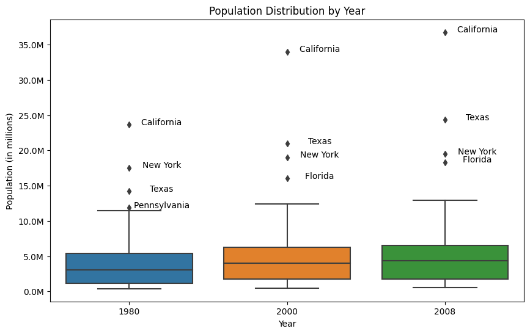

# HW 5 - CS 625, Fall 2023

Maaz Hasnain Khan 

Due: November 8, 2023

## Dataset 1: Table 12 - Resident Population--States (pg. 21 in PDF)

### Boxplot: Show the distributions of the population of all states in 1980, 2000 (either April or July), and 2008

For the boxplot we had to first extract the data from the raw file. This was done using Excel as we had to only extract four (4) columns, namely, 'State', 'Population in 1980', 'Population in 2000' and 'Population in 2008'. After this we had to conver the values of population from string to number and then multiply it by 1000 as the population was given in thousands. This was done using Open Refine GREL Function. The GREL used is written below:

```

toNumber(value.replace(",", ""))*1000

```

After converting the values into numbers and multiplying them by 1000, we extracted the CSV file and uploaded it into Google Drive to use it in Google Colaboratory Notebook.



##### Code

```

import pandas as pd
import matplotlib.pyplot as plt
import seaborn as sns
from google.colab import drive
from matplotlib.ticker import FuncFormatter

drive.mount("/content/drive", force_remount=True)
data = pd.read_csv("/content/drive/MyDrive/CS_625/CS_625_HW5/dataset1-boxplot-csv.csv")

pop_1980 = data['1980']
pop_2000 = data['2000']
pop_2008 = data['2008']
states = data['State']
def millions(x, pos):
    return '%1.1fM' % (x * 1e-6)

plt.figure(figsize=(10, 6))
sns.boxplot(data=[pop_1980, pop_2000, pop_2008])
plt.title("Population Distribution by Year")
plt.xlabel("Year")
plt.ylabel("Population (in millions)")
plt.gca().yaxis.set_major_formatter(FuncFormatter(millions))
plt.xticks([0, 1, 2], ['1980', '2000', '2008'])

outliers = {}
for i, data_series in enumerate([pop_1980, pop_2000, pop_2008]):
    quartile_1 = data_series.quantile(0.25)
    quartile_3 = data_series.quantile(0.75)
    iqr = quartile_3 - quartile_1
    lower_bound = quartile_1 - 1.5 * iqr
    upper_bound = quartile_3 + 1.5 * iqr
    data_series_outliers = data_series[(data_series < lower_bound) | (data_series > upper_bound)]
    outliers[i] = data_series_outliers

for i, year in enumerate(['1980', '2000', '2008']):
    for outlier in outliers[i]:
        state_name = states[data[year] == outlier].values[0]
        plt.annotate(state_name, (i, outlier), textcoords='offset points', xytext=(40, 0), ha='center')

plt.show()


```

##### Explanation

The code utilizes the pandas, matplotlib, and seaborn libraries to create a boxplot that represents population data by year. The data, contained in a CSV file, is loaded into a Pandas DataFrame. The code defines variables for the population data of the years 1980, 2000, and 2008, as well as a variable to store state names. A custom tick label formatter is used to display population values in millions on the y-axis. The code then creates a boxplot, with proper title and labels. It identifies outliers in the data for each year and annotates these outliers with their corresponding state names. Finally, the code displays the boxplot with state names as annotations.

The boxplot created represents the distribution of population data for the years 1980, 2000, and 2008 across various U.S. states. The figure is split into three parts: showing a boxplot, one for each of the mentioned years. The boxplot displays the following key statistics for each year:

- **Median (Q2):** The middle value of the dataset, dividing it into two equal halves.
- **First Quartile (Q1):** The 25th percentile, marking the lower end of the middle 50% of the data.
- **Third Quartile (Q3):** The 75th percentile, marking the upper end of the middle 50% of the data.
- **Whiskers:** Vertical lines connecting the box to the minimum and maximum data values within 1.5 times the IQR (Interquartile Range).
- **Outliers:** Individual data points falling outside the whiskers, indicating extreme or unusual values.

#### Advantages of the Boxplot Chart for Showing Population Distributions:

**Clear Overview of Distribution:** The boxplot provides a clear visual summary of the population distribution, showing the median, quartiles, and outliers for each year. This allows for a quick understanding of the central tendency and spread of populations in different years for each state.

**Easy to Compare Distributions:** With boxplots for multiple years displayed side by side, it's easy to compare the population distributions across different years for each state. This is particularly useful for identifying trends and changes in population over time.

**Identifying Outliers:** Boxplots make it easy to identify states with unusually high or low populations in a specific year by marking outliers as individual data points. This information is valuable for pinpointing states with exceptional population characteristics.

**Compact and Space-Efficient:** Boxplots are space-efficient, allowing you to represent multiple distributions in a single chart. This is especially advantageous when you want to compare a large number of states and years without cluttering the chart.

#### Disadvantages of the Boxplot Chart for Showing Population Distributions:

**Limited Detail:** While boxplots provide a high-level summary of the population distribution, they may lack the level of detail necessary to understand the exact shape of the distribution, such as the presence of multiple modes or skewness. You might miss finer nuances that other chart types, like histograms, can reveal.

**Exact Values Not Evident:** Boxplots do not readily display the exact population values, making it challenging to read specific data points. If precise values are crucial, additional charts or tools may be needed to provide detailed information.

#### Simple Observations from the Chart:

- The median population for most states tends to increase from 1980 to 2008, indicating general population growth across the country over the years.

- Outliers can be observed in all years, with some states having significantly higher or lower populations compared to the majority of states. For example, California is an outlier with a notably high population in all three years.

- While the majority of states show population growth over time, the range and distribution of populations vary, as indicated by the differences in the boxplots' heights and whiskers for each year.

In summary, the boxplot chart provides a concise summary of population distributions for different years, making it easy to compare and identify outliers. However, it lacks the level of detail that other charts, such as histograms, can provide, and exact values are not immediately apparent from the chart.

## References

* Third Dataset Raw, [dataset_3_raw.xls](dataset_3_raw.xls)
* Third Dataset EC Raw, [dataset_3_ec_raw.xls](dataset_3_ec_raw.xls)
* Second Dataset Raw, [dataset_2_raw.xls](dataset_2_raw.xls)
* Python File, [CS_625_HW4_Final.ipynb](CS_625_HW4_Final.ipynb)
* Third Dataset Question 1 Excel File, [dataset3_q1_excel.xlsx](dataset3_q1_excel.xlsx)
* Third Dataset Question 2 Excel File, [dataset3_q2_excel.xlsx](dataset3_q2_excel.xlsx)
* Third Dataset EC Normalized Data CSV, [dataset3_normalized_data.csv](dataset3_normalized_data.csv)
* Third Dataset EC Excel File, [dataset3_ec_excel.xlsx](dataset3_ec_excel.xlsx)
* Third Dataset Question 1 CSV File (EC Recreation Python), [dataset3_q1.csv](dataset3_q1.csv)
* Third Dataset Question 2 CSV File (EC Recreation Python), [dataset3_q2.csv](dataset3_q2.csv)
* Second Dataset Question 1 Excel File (EC Extra Dataset), [dataset2_q1_excel.xlsx](dataset2_q1_excel.xlsx)
* Second Dataset Question 2 CSV File (EC Extra Dataset), [dataset2_q2.csv](dataset2_q2.csv)
* Second Dataset Question 2 Excel File (EC Extra Dataset), [dataset2_q2_excel.xlsx](dataset2_q2_excel.xlsx)
* Seaborn, <https://seaborn.pydata.org/>
* Microsoft Support, <https://support.microsoft.com/en-us/office/video-create-a-chart-4d95c6a5-42d2-4cfc-aede-0ebf01d409a8>
* Ablebits, <https://www.ablebits.com/office-addins-blog/make-bar-graph-excel/#:~:text=Making%20a%20bar%20graph%20in,type%20you%20want%20to%20insert.>
* Ablebits, <https://www.ablebits.com/office-addins-blog/excel-charts-title-axis-legend/>
* Medium, <https://pub.towardsai.net/understanding-pandas-melt-pd-melt-362954f8c125?gi=2b8bd101398b>
* Stackoverflow, <https://stackoverflow.com/questions/60625159/using-pandas-dataframe-melt-with-seaborn-barplot>
* Stackoverflow, <https://stackoverflow.com/questions/76644454/is-there-an-alternate-for-palette-while-plotting-barplot-through-seaborn-objec>
* Stackoverflow, <https://stackoverflow.com/questions/74715767/how-to-rotate-the-xticks-with-seaborn-objects>
* Stackoverflow, <https://stackoverflow.com/questions/53694724/how-to-prevent-matplotlib-from-showing-decimal-years-in-horizontal-axis>
* United States Census Bureau, <https://www.census.gov/library/publications/2009/compendia/statab/129ed/births-deaths-marriages-divorces.html>
* United States Census Bureau, <https://www.census.gov/library/publications/2009/compendia/statab/129ed/population.html>


