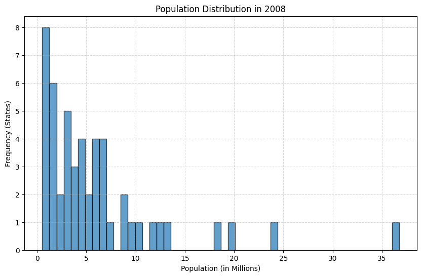
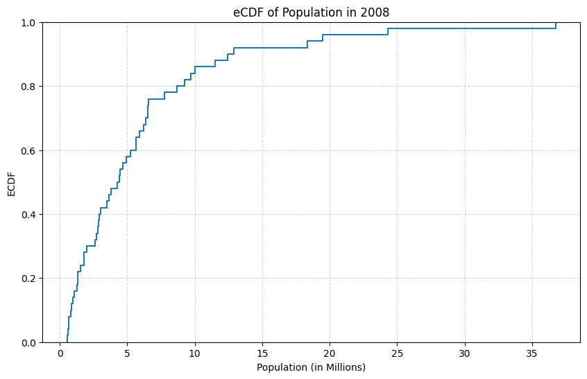
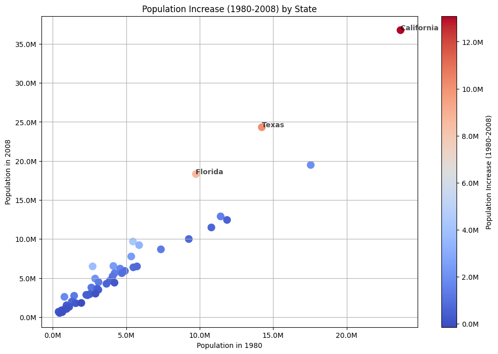
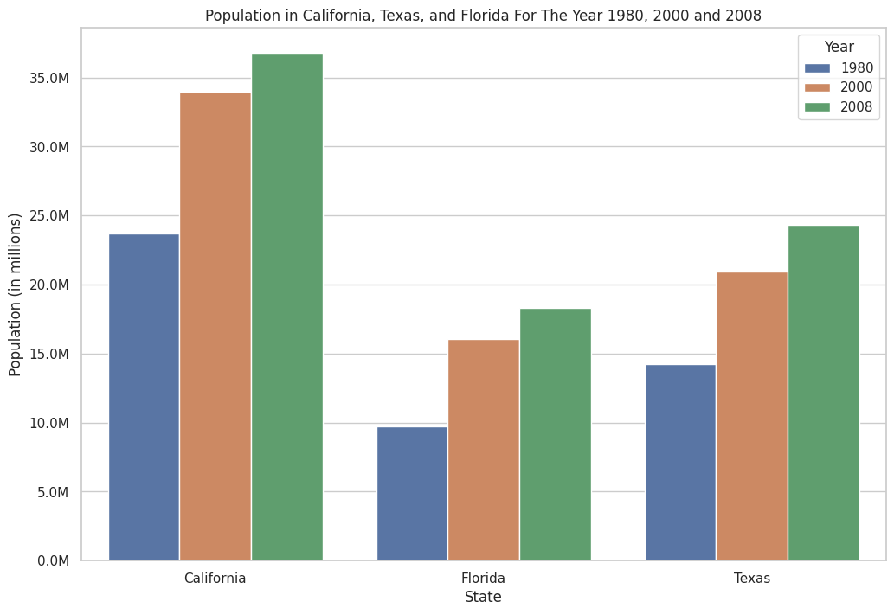
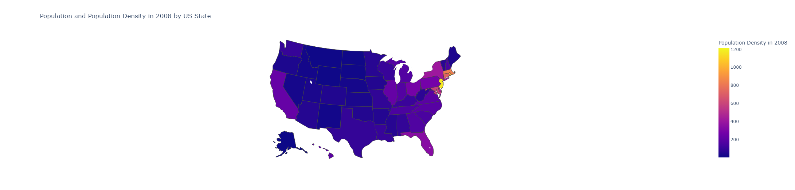
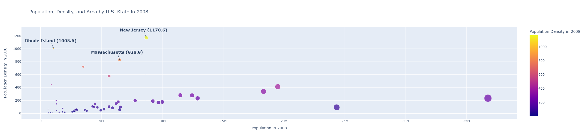

# HW 5 - CS 625, Fall 2023

Maaz Hasnain Khan 

Due: November 8, 2023

# Part 1: Create Distribution Charts

## Dataset 1: Table 12 - Resident Population--States (pg. 21 in PDF)

### Boxplot: Show the distributions of the population of all states in 1980, 2000 (either April or July), and 2008

For the boxplot, we had to first extract the data from the raw file. This was done using MS Excel as we had to only extract four (4) columns, namely, 'State', 'Population in 1980', 'Population in 2000' and 'Population in 2008'. After this, we had to convert the values of the population from string to number and then multiply it by 1000 as the population was given in thousands. This was done using Open Refine GREL Function. The GREL used is written below:

```

toNumber(value.replace(",", ""))*1000

```

After converting the values into numbers and multiplying them by 1000, we extracted the CSV file and uploaded it to Google Drive to use it in the Google Colaboratory Notebook.


To see the charts go to **[Google Colaboratory Notebook](https://colab.research.google.com/drive/1BhHmJPChmDjoL2rRhJJo6cb-Dm1Uozw9?usp=sharing).**

##### Code

```

import pandas as pd
import matplotlib.pyplot as plt
import seaborn as sns
from google.colab import drive
from matplotlib.ticker import FuncFormatter

drive.mount("/content/drive", force_remount=True)
data = pd.read_csv("/content/drive/MyDrive/CS_625/CS_625_HW5/dataset1-boxplot-csv.csv")

pop_1980 = data['1980']
pop_2000 = data['2000']
pop_2008 = data['2008']
states = data['State']
def millions(x, pos):
    return '%1.1fM' % (x * 1e-6)

plt.figure(figsize=(10, 6))
sns.boxplot(data=[pop_1980, pop_2000, pop_2008])
plt.title("Population Distribution by Year")
plt.xlabel("Year")
plt.ylabel("Population (in millions)")
plt.gca().yaxis.set_major_formatter(FuncFormatter(millions))
plt.xticks([0, 1, 2], ['1980', '2000', '2008'])

outliers = {}
for i, data_series in enumerate([pop_1980, pop_2000, pop_2008]):
    quartile_1 = data_series.quantile(0.25)
    quartile_3 = data_series.quantile(0.75)
    iqr = quartile_3 - quartile_1
    lower_bound = quartile_1 - 1.5 * iqr
    upper_bound = quartile_3 + 1.5 * iqr
    data_series_outliers = data_series[(data_series < lower_bound) | (data_series > upper_bound)]
    outliers[i] = data_series_outliers

for i, year in enumerate(['1980', '2000', '2008']):
    for outlier in outliers[i]:
        state_name = states[data[year] == outlier].values[0]
        plt.annotate(state_name, (i, outlier), textcoords='offset points', xytext=(40, 0), ha='center')

plt.show()


```

##### Explanation

The code utilizes the Pandas, Matplotlib, and Seaborn libraries to create a boxplot that represents population data by year. The data, contained in a CSV file, is loaded into a Pandas DataFrame. The code defines variables for the population data of the years 1980, 2000, and 2008, as well as a variable to store state names. A custom tick label formatter is used to display population values in millions on the y-axis. The code then creates a boxplot, with proper title and labels. It identifies outliers in the data for each year and annotates these outliers with their corresponding state names. Finally, the code displays the boxplot with state names as annotations.

The boxplot created represents the distribution of population data for the years 1980, 2000, and 2008 across various U.S. states. The figure is split into three parts: showing a boxplot, one for each of the mentioned years. The boxplot displays the following key statistics for each year:

- **Median (Q2):** The middle value of the dataset, dividing it into two equal halves.
- **First Quartile (Q1):** The 25th percentile, marking the lower end of the middle 50% of the data.
- **Third Quartile (Q3):** The 75th percentile, marking the upper end of the middle 50% of the data.
- **Whiskers:** Vertical lines connecting the box to the minimum and maximum data values within 1.5 times the IQR (Interquartile Range).
- **Outliers:** Individual data points falling outside the whiskers, indicating extreme or unusual values.

### Advantages Of The Boxplot Chart For Showing Population Distributions:

**Clear Overview Of Distribution:** The boxplot provides a clear visual summary of the population distribution, showing the median, quartiles, and outliers for each year. This allows for a quick understanding of the central tendency and spread of populations in different years for each state.

**Comparative Analysis:** With boxplots for multiple years displayed side by side, it's easy to compare the population distributions across different years for each state. This is particularly useful for identifying trends and changes in population over time.

**Identifying Outliers:** Boxplots make it easy to identify states with unusually high or low populations in a specific year by marking outliers as individual data points. This information is valuable for pinpointing states with exceptional population characteristics.

**Compact And Space-Efficient:** Boxplots are space-efficient, allowing you to represent multiple distributions in a single chart. This is especially advantageous when you want to compare a large number of states and years without cluttering the chart.

### Disadvantages Of The Boxplot Chart For Showing Population Distributions:

**Limited Detail:** While boxplots provide a high-level summary of the population distribution, they may lack the level of detail necessary to understand the exact shape of the distribution, such as the presence of multiple modes or skewness. You might miss finer nuances that other chart types, like histograms, can reveal.

**Exact Values Not Evident:** Boxplots do not readily display the exact population values, making it challenging to read specific data points. If precise values are crucial, additional charts or tools may be needed to provide detailed information.

### Simple Observations From The Chart:

- The median population for most states tends to increase from 1980 to 2008, indicating general population growth across the country over the years.

- Outliers can be observed in all years, with some states having significantly higher or lower populations compared to the majority of states. For example, California is an outlier with a notably high population in all three years.

- While the majority of states show population growth over time, the range and distribution of populations vary, as indicated by the differences in the boxplots' heights and whiskers for each year.

In summary, the boxplot chart provides a concise summary of population distributions for different years, making it easy to compare and identify outliers. However, it lacks the level of detail that other charts, such as histograms, can provide, and exact values are not immediately apparent from the chart.

### eCDF and histogram: Show the distribution of the population of all states in one of the years (your chart title must indicate which year)

For the eCDF and Histogram, the same CSV file was used as in the Boxplot. Therefore, we will not discuss the cleaning steps again here.





To see the charts go to **[Google Colaboratory Notebook](https://colab.research.google.com/drive/1BhHmJPChmDjoL2rRhJJo6cb-Dm1Uozw9?usp=sharing).**

##### Code

```

import pandas as pd
import matplotlib.pyplot as plt
import seaborn as sns
from google.colab import drive

drive.mount("/content/drive", force_remount=True)
data = pd.read_csv("/content/drive/MyDrive/CS_625/CS_625_HW5/dataset1-boxplot-csv.csv")

pop_2008 = data['2008'] / 1e6

plt.figure(figsize=(10, 6))
plt.hist(pop_2008, bins=50, edgecolor='k', alpha=0.7)
plt.title("Population Distribution in 2008")
plt.xlabel("Population (in Millions)")
plt.ylabel("Frequency (States)")
plt.grid(True, linestyle='--', alpha=0.5)
plt.show()

plt.figure(figsize=(10, 6))
sns.ecdfplot(pop_2008, marker='', linestyle='-')
plt.title("eCDF of Population in 2008")
plt.xlabel("Population (in Millions)")
plt.ylabel("ECDF")
plt.grid(True, linestyle='--', alpha=0.5)
plt.show()

```

##### Explanation

The code utilizes the Pandas, Matplotlib, and Seaborn libraries to analyze and visualize population data from the year 2008. The data, contained in a CSV file, is loaded into a Pandas DataFrame. The population values for 2008 are extracted and converted into millions for a more intuitive presentation. The code then creates two separate plots.

The first plot is a histogram, generated using Matplotlib, to depict the distribution of population values in 2008. This histogram is divided into 50 bins to provide a detailed view of the data distribution. This code generates a histogram, with proper title and labels.

The second plot, an empirical cumulative distribution function (eCDF) plot, is created using Seaborn. This plot illustrates how the data is cumulatively distributed, forming a step-like graph. Similar to the histogram plot, it includes titles and axis labels.

In essence, these visualizations offer insights into the distribution and cumulative distribution of population data for the year 2008, allowing for a clearer understanding of how populations were distributed among the states during the year 2008.

The histogram visually represents the population distribution in the U.S. for the year 2008, with the x-axis indicating the population in millions and the y-axis showing the frequency of states falling within each population range. The eCDF plot, on the other hand, depicts the cumulative distribution of population, where the x-axis displays population values, and the y-axis represents the cumulative probability of states having a population less than or equal to a given value.


### Advantages Of The Histogram For Showing Population Distributions:

**Clear Overview Of Distribution:** The histogram offers a clear visual representation of the population distribution, making it easy to see the frequency of states falling within specific population ranges. This is valuable for understanding how populations are distributed.

**Comparative Analysis:** The histogram allows for straightforward comparisons between states, enabling you to quickly identify differences in population sizes and patterns in the distribution.

**Key Feature Identification:** By examining the histogram, you can easily spot central tendencies, common population ranges, and states with unusually high or low populations. This aids in identifying significant population characteristics within the data.

### Disadvantages Of The Histogram For Showing Population Distributions:

**Limited Detail:** The histogram may not provide intricate details about the shape of the population distribution. For example, it might not reveal whether the distribution is unimodal, bimodal, skewed, or multimodal.

**Exact Values Not Evident:** The histogram doesn't readily display the exact population values for individual states. If precise values are important, additional charts or data exploration tools may be needed to extract this information from the dataset.

### Advantages Of The eCDF For Showing Population Distributions:

**Cumulative Overview:** The eCDF offers a cumulative view of the population distribution, showcasing the proportion of states with populations less than or equal to a given value. This is helpful for understanding cumulative trends.

**Visualizing Percentiles:** It provides a clear way to visualize percentiles, making it easy to see, for example, what percentage of states have populations below a specific value.

### Disadvantages Of The eCDF For Showing Population Distributions:

**Limited Detail:** Similar to the histogram, the eCDF may not reveal detailed information about the shape of the distribution, such as the presence of multiple modes or skewness.

**Exact Values Not Evident:** The eCDF plot does not display the precise population values for individual states. For examining specific data points, you would need to cross-reference with the original dataset.

In summary, the histogram provides a clear view of the population distribution, facilitates comparisons, and aids in identifying key features. However, it might not offer fine-grained insights into the distribution's shape or specific data values. The eCDF plot, on the other hand, offers a cumulative perspective, making it suitable for visualizing percentiles and cumulative trends but also lacking in details about the distribution's shape and specific data values.

### Simple Observations from the Charts:

- From the histogram, it's evident that the majority of states had populations below 10 million in 2008, while a few states had significantly larger populations.

- The eCDF chart shows that nearly 58% of U.S. states had populations below 5 million in 2008. However, these states collectively accounted for only 22.38% of the total U.S. population for the year 2008, highlighting a disparity in population distribution.

- If we look at states below 10 million population 84% of U.S. states had populations under 10 million. These 42 states collectively accounted for 52% of the total U.S. population, totaling 157.72 million. This means that the rest of the 48% of the total U.S. lives in the rest of remaining 8 states. This reveals a notable concentration of the U.S. population in a smaller number of states with larger populations.

# Part 2: Further Analysis

### Use the charts that you created in Part 1 to guide further investigation of the data. State at least 2 interesting findings about the data and explain how you used one or more of the distribution charts to guide the investigation into this finding.

### Dramatic Increase In Population From The Year 1980 to 2008

For these charts, the same CSV file was used as in the Boxplot, eCDF and Histogram. Therefore, we will not discuss the cleaning steps again here.





To see the charts go to **[Google Colaboratory Notebook](https://colab.research.google.com/drive/1BhHmJPChmDjoL2rRhJJo6cb-Dm1Uozw9?usp=sharing).**

##### Code For Scatter Plot

```

import pandas as pd
import matplotlib.pyplot as plt
from matplotlib.ticker import FuncFormatter
from google.colab import drive

drive.mount("/content/drive", force_remount=True)
data = pd.read_csv("/content/drive/MyDrive/CS_625/CS_625_HW5/dataset1-boxplot-csv.csv")

data['Population Increase'] = data['2008'] - data['1980']

data = data.sort_values(by='Population Increase', ascending=False)

top_states = data.head(3)

def millions(x, pos):
    return f'{x/1e6:.1f}M'

plt.figure(figsize=(12, 8))
scatter = plt.scatter(data['1980'], data['2008'], c=data['Population Increase'], cmap='coolwarm', s=100)
plt.title('Population Increase (1980-2008) by State')
plt.xlabel('Population in 1980')
plt.ylabel('Population in 2008')
plt.grid(True)


cbar = plt.colorbar(scatter, format=FuncFormatter(millions))
cbar.set_label('Population Increase (1980-2008)')

for i, row in top_states.iterrows():
    plt.annotate(row['State'], (row['1980'], row['2008']), fontsize=10, alpha=0.7, weight='bold', color='black')

plt.gca().yaxis.set_major_formatter(FuncFormatter(millions))
plt.gca().xaxis.set_major_formatter(FuncFormatter(millions))

plt.show()

```

##### Explanation

The code utilizes the python libraries like Pandas and Matplotlib to create a meaningful visualization. The data, contained in a CSV file, is loaded into a Pandas DataFrame. The CSV file contains state-wise population data for the years 1980 and 2008. The code calculates the population increase for each state during this time frame by subtracting the 1980 population from the 2008 population and adding this information as a new column to the dataset.

Next, the code sorts the dataset in descending order based on the population increase, helping to identify the states with the most significant population growth during this period. It then selects the top three states with the highest population increase and creates a scatter plot. The x-axis represents the population in 1980, the y-axis represents the population in 2008, and the color of the data points indicates the population increase, with a color bar for reference. Additionally, it highlights the names of the top three states on the scatter plot, providing further context to the data. The code employs custom formatting functions to display population numbers in millions (M) and generates a scatter plot with proper title and axes labels.

##### Code For Bar Chart

```

import pandas as pd
import seaborn as sns
import matplotlib.pyplot as plt
from matplotlib.ticker import FuncFormatter
from google.colab import drive

drive.mount("/content/drive", force_remount=True)
data = pd.read_csv("/content/drive/MyDrive/CS_625/CS_625_HW5/dataset1-boxplot-csv.csv")

data['State'] = data['State'].str.strip()

states_to_plot = ['California', 'Texas', 'Florida']
selected_data = data[data['State'].isin(states_to_plot)]

melted_data = selected_data.melt(id_vars=['State'], var_name='Year', value_name='Population')

sns.set(style="whitegrid")

plt.figure(figsize=(12, 8))
barplot = sns.barplot(x='State', y='Population', hue='Year', data=melted_data)

plt.title('Population in California, Texas, and Florida For The Year 1980, 2000 and 2008')
plt.xlabel('State')
plt.ylabel('Population (in millions)')

def millions_formatter(x, pos):
    return f'{x / 1e6:.1f}M'

y_formatter = FuncFormatter(millions_formatter)
barplot.yaxis.set_major_formatter(y_formatter)

plt.legend(title='Year')

plt.show()

```

##### Explanation

The code utilizes Python with libraries like Pandas, Seaborn, and Matplotlib to generate a bar chart. The data, contained in a CSV file, is loaded into a Pandas DataFrame. The CSV file contains state-wise population data. The code then selects the specific states (California, Texas, and Florida) for analysis and creates a new dataset.

To prepare the data for visualization, the code melts the dataset, which means it reshapes it from a wide format, with separate columns for each year, into a long format. This transformation consolidates the population values for each state-year combination into a single column, making it easier to work with and plot. The melted data is used for creating the bar chart.

The code then generates a bar plot using Seaborn's barplot function. The x-axis represents the states (California, Texas, and Florida), the y-axis shows the population in millions, and the bars are grouped by year (1980, 2000, and 2008) and color-coded accordingly. A custom formatting function is applied to the y-axis labels to display population numbers in millions (M). This generates a bar chart with proper axes and labels.

### Analysis

The two charts offer valuable insights into the population changes of U.S. states over a specific time period (1980 to 2008) and allow for a deeper analysis of the data. First, we'll discuss these charts separately and then finally give our hypotheses based on that analysis.

### Scatter Plot

The scatter plot compares the population of the U.S. states for the years 1980 and 2008. It provides a visual representation of how the populations of these states evolved over time. The color of each data point represents the population increase during this period.

**Population Growth Trends:** The chart reveals that California had the highest population of the three states throughout the observed years. It also shows that California, Texas and Florida experienced a dramatic population growth. California and Texas, in particular, had substantial increases, with California leading in population size. Florida also exhibited significant growth but started with a smaller base population.

**Relative Population Changes:** By comparing the positions of the data points, we can observe that California's population increased the most during the period, followed by Texas and then Florida. This highlights the significant population growth in California and Texas.

**Population Increase Variation:** The color gradient (via the color bar) provides a visual understanding of the magnitude of population increase. Darker colors indicate higher population increases. It demonstrates that California experienced the most substantial population increase among the three states.

### Bar Chart

The bar chart represents the population data for California, Texas, and Florida for the years 1980, 2000, and 2008.

**Comparison of States:** This chart makes it easy to compare the populations of California, Texas, and Florida directly. California consistently had the highest population throughout the years, followed by Texas and then Florida. This reflects the states' relative sizes.

**Population Growth Over Time:** The bar chart illustrates the population growth for each state during the observed years. It shows that California's population increased significantly over the period, Texas experienced substantial growth, and Florida had a steady increase.

**Yearly Changes:** By comparing bars for each state from 1980 to 2008, you can see how populations changed over time. California's population grew the most during this period, while Florida's population saw the most significant increase in the 2000s.

**Magnitude of Population:** The chart does not only show population changes but also the magnitude of populations for each state. For example, you can see that California's population is significantly larger than that of Texas and Florida.

In conclusion, the charts provide a clear picture of how the populations of California, Texas, and Florida evolved over a specific time frame. They allow for various analyses, including relative growth rates, yearly comparisons, and the overall population size of each state. It's apparent that California had the most substantial population increase and maintained the highest population among the three states. However, it has to be taken into account that California's population was already very large and that increase might just have been relative to that.

### Hypotheses

**Economic Opportunities:** One reason for California's substantial population growth could be the state's robust economy, driven by the technology and entertainment industries. People may have moved there in search of better job opportunities and higher income.

**Migration Patterns:** Texas' significant population growth, especially from 1980 to 2000, may be attributed to its business-friendly environment and relatively lower cost of living, attracting individuals and families from other states.

**Retirement Destinations:** Florida's population increase could be influenced by its reputation as a retirement destination due to its warm climate and lack of state income tax, making it appealing to retirees and senior citizens.

**Urbanization:** The observed trends may also reflect the urbanization of these states, with people moving from rural areas to cities in search of better amenities and quality of life.

In summary, factors such as economic opportunities, business environments, lifestyle preferences, and public policies can all contribute to the observed population dynamics in California, Texas, and Florida. Further analysis and research can be conducted to validate these hypotheses and gain a deeper understanding of the underlying reasons for the population shifts in these states.

### Population Distribution According to Population Density

For the analysis regarding population density two raw datasets were used:

- Dataset 1: Table 12 - Resident Population--States (pg. 21 in PDF)

- Dataset 2: Table 13 - State Population--Rank, Percent Change, And Population Density (pg. 22 in PDF)

From these two datasets a new CSV file was created having the columns 'State', 'State Code', 'Population in 2008' and 'Population Density in 2008'. The columns were extracted simply using MS Excel. After this, we had to convert the values of population and population density from string to number and then multiply only the population by 1000 as the population was given in thousands. This was done using Open Refine GREL Function. The GREL used is written below:

```

toNumber(value.replace(",", ""))

```
This GREL converted both columns from string to numbers. Then we used another GREL function to multiply the population by a thousand.

```

value*1000

```
After converting the values into numbers and multiplying the population by 1000, we extracted the CSV file and uploaded it into Google Drive to use it in Google Colaboratory Notebook.





The charts created are interactive. To see the charts go to **[Google Colaboratory Notebook](https://colab.research.google.com/drive/1BhHmJPChmDjoL2rRhJJo6cb-Dm1Uozw9?usp=sharing).**

##### Code For Choropleth Chart

```

import pandas as pd
import plotly.express as px
from google.colab import drive

drive.mount('/content/drive', force_remount=True)
data = pd.read_csv("/content/drive/MyDrive/CS_625/CS_625_HW5/dataset1_popdensity.csv")

def format_hover_data(state, population, density):
    return f'State: {state}<br>Population: {population / 1e6:.2f}M'

data['CustomHoverData'] = data.apply(lambda row: format_hover_data(row['State'], row['Population in 2008'], row['Population Density in 2008']), axis=1)

fig = px.choropleth(
    data,
    locations="State Code",
    color="Population Density in 2008",
    locationmode="USA-states",
    scope="usa",
    title="Population and Population Density in 2008 by US State",
    color_continuous_midpoint=610,
    hover_data=["State", "CustomHoverData"],
)

fig.show()

```

##### Explanation

The code utilizes Python libraries, including Pandas for data manipulation and Plotly Express for interactive data visualization. The data, contained in a CSV file, is loaded into a Pandas DataFrame. The CSV file contains state-wise population and population density data for the year 2008. The *format_hover_data* function is defined to create a custom tooltip or hover data for each state on the map. It takes the state's name, population, and population density as input and formats the data in a readable way. This custom hover data will provide information about the state's name, population (in millions), and population density in 2008.

Next, the choropleth map is created using Plotly Express. It specifies the dataset, the location information (in this case, the state code, which is a common way to represent states on maps), and the color data (population density in 2008). The locationmode is set to "USA-states" to indicate that the map represents U.S. states.

The resulting choropleth map allows users to interactively explore and understand population density variations across U.S. states in 2008. It provides a clear visual representation of which states have higher or lower population densities, making it a valuable tool for data analysis and interpretation.

##### Code For Scatter Plot

```

import pandas as pd
import plotly.express as px
import matplotlib.pyplot as plt
from google.colab import drive

drive.mount('/content/drive')
data = pd.read_csv("/content/drive/MyDrive/CS_625/CS_625_HW5/dataset1_popdensity.csv")

data = data.sort_values(by="Population Density in 2008", ascending=False)

top_states = data.head(3)

fig = px.scatter(
    data,
    x="Population in 2008",
    y="Population Density in 2008",
    size="Population in 2008",
    color="Population Density in 2008",
    hover_name="State",
    title="Population, Density, and Area by U.S. State in 2008"
)

for i, row in top_states.iterrows():
    annotation_text = f"{row['State']} ({row['Population Density in 2008']})"
    bold_text = f"<b>{annotation_text}</b>"
    fig.add_annotation(
        x=row["Population in 2008"],
        y=row["Population Density in 2008"],
        text=bold_text,
        showarrow=True,
        arrowhead=4,
        font=dict(size=15)
    )

fig.show()

```

##### Explanation

The code utilizes Python libraries, including Pandas for data manipulation, Matplotlib and Plotly Express for interactive data visualization. The data, contained in a CSV file, is loaded into a Pandas DataFrame. The CSV file contains state-wise population and population density data for the year 2008. It's then sorted in descending order based on "Population Density in 2008." This sorting arranges the data in such a way that states with the highest population density appear at the top of the DataFrame.

The top_states DataFrame is created to store the top three states with the highest population density. These states are identified based on the sorted dataset.

The code proceeds to create a scatter plot using Plotly Express. This scatter plot visualizes the relationship between "Population in 2008" on the x-axis, "Population Density in 2008" on the y-axis, and the size and color of data points, respectively. For a more informative representation of the top three states with the highest population density, the code adds custom annotations for these states.

All in all, this creates an interactive scatter plot that allows users to explore the population and population density data for U.S. states in 2008.

### Analysis

The two charts offer valuable insights into the population distribution of U.S. states in terms of population density and allow for a deeper analysis of the data. First, we'll discuss these charts separately and then finally give our hypotheses based on that analysis.

### Choropleth

The choropleth map color-codes U.S. states based on their population density in 2008. It allows for an immediate visual comparison of population density variations across states.

**Population Density Distribution:** The map clearly illustrates that population density varies significantly across states. For instance, highly populated states like California and New Jersey have brighter color shades, indicating high population density, while sparsely populated states like Alaska and Montana are much darker in color, signifying lower population density. The map reveals that several East Coast states, including New Jersey, Connecticut, and Rhode Island, have notably high population densities. This regional trend suggests that the East Coast generally exhibits higher population density compared to inland or western states.

**Urban vs. Rural:** The map can help identify urban and rural regions. States with high population density are more likely to have urban centers, while states with low density are likely to have more rural areas.

**Coastal vs. Inland:** States with coastlines tend to have higher population density due to factors such as economic opportunities and accessibility.

### Scatterplot

The scatter plot displays the population in 2008 on the x-axis and the population density in 2008 on the y-axis. The point size represents the population, and the color represents population density.

**Cluster Identification:** By observing the scatter plot, we can identify clusters of states with varying characteristics. Some states have a high population and high density, while others have a high population but lower density. States with low population and density are evident as well. The scatter plot shows that states on the East Coast, such as New Jersey, Massachusetts, and Rhode Island, exhibit higher population density.

**Outliers:** Outlying states are also visible. For instance, California stands out with a high population and high density, while Alaska stands out with a low population and extremely low density.

**Correlations:** The plot suggests a relationship between population size and density. Some states have a high population and high density, while others have a low population and low density. Understanding these correlations can provide insights into state development and urban planning.

### Hypotheses

**Economic Opportunities:** States with higher population density, like California and New Jersey, may offer greater economic opportunities, including better job prospects and higher wages. This can attract a larger population.

**Urbanization:** Regions with high population density are often associated with urbanization and industrial development. These states may have more extensive urban areas and infrastructure.

**Coastal Locations:** States with coastlines, such as California and New Jersey, tend to have higher population density due to their appeal to both residents and tourists. Coastal areas often offer a wide range of job opportunities and amenities.

**Historical Colonization:** One possible explanation for the higher population density on the East Coast is historical. Many of the earliest European settlements and colonization efforts in the United States began on the East Coast. This initial concentration of settlers and subsequent population growth could have left a lasting impact on population density. The presence of historical cities, ports, and infrastructure may have contributed to ongoing urbanization and population density in these states. This historical context may continue to shape the population landscape today.

In conclusion, the analysis of U.S. state population density in 2008, through both the choropleth map and scatter plot, reveals an intricate interplay of factors influencing regional demographic patterns. Economic opportunities, urbanization, coastal locations, and historical colonization stand out as key drivers of population density variations. Notably, the historical significance of the East Coast as an early hub for colonization has left a lasting impact on the region's high population density. Further research can help us delve deeper into these factors, providing a richer understanding of population dynamics in the United States.

## References

* First Dataset Raw, [dataset_1_raw.xls](dataset_1_raw.xls)
* Second Dataset EC Raw, [dataset_2_raw.xls](dataset_2_raw.xls)
* Python File, [CS_625_HW5.ipynb](CS_625_HW5.ipynb)
* First CSV (Boxplot, eCDF, Histogram, Scatter plot (Matplotlib), Barchart), [dataset1-boxplot-csv.csv](dataset1-boxplot-csv.csv)
* Second CSV (Choropleth, Scatter plot (Plotly)), [dataset1_popdensity.csv](dataset1_popdensity.csv)
* Seaborn, <https://seaborn.pydata.org/generated/seaborn.boxplot.html>
* Seaborn, <https://seaborn.pydata.org/generated/seaborn.ecdfplot.html>
* Seaborn, <https://seaborn.pydata.org/generated/seaborn.histplot.html>
* Plotly, <https://plotly.com/python/reference/layout/annotations/>
* Plotly, <https://plotly.com/python/text-and-annotations/>
* Plotly, <https://plotly.com/python/choropleth-maps/>
* Plotly, <https://plotly.com/python/line-and-scatter/>
* Medium, <https://lisandroabulatif.medium.com/create-charts-maps-and-scatter-matrix-with-plotly-and-google-colab-55a5303326ab>
* Youtube, <https://www.youtube.com/watch?v=oACIIEh6cgY>
* Youtube, <https://www.youtube.com/watch?v=sXuoikhChYo>
* Stackoverflow, <https://stackoverflow.com/questions/60199939/how-to-format-plotly-title-in-python-as-bold-when-the-title-is-a-variable>
* Stackoverflow, <https://stackoverflow.com/questions/71328058/add-more-than-two-variables-in-hover-text-of-plotly-object-with-more-than-one-tr>
* Stackoverflow, <https://stackoverflow.com/questions/71104827/plotly-express-choropleth-map-custom-color-continuous-scale>
* Stackoverflow, <https://stackoverflow.com/questions/50067301/make-plotly-annotation-font-bold>
* United States Census Bureau, <https://www.census.gov/library/publications/2009/compendia/statab/129ed/population.html>


