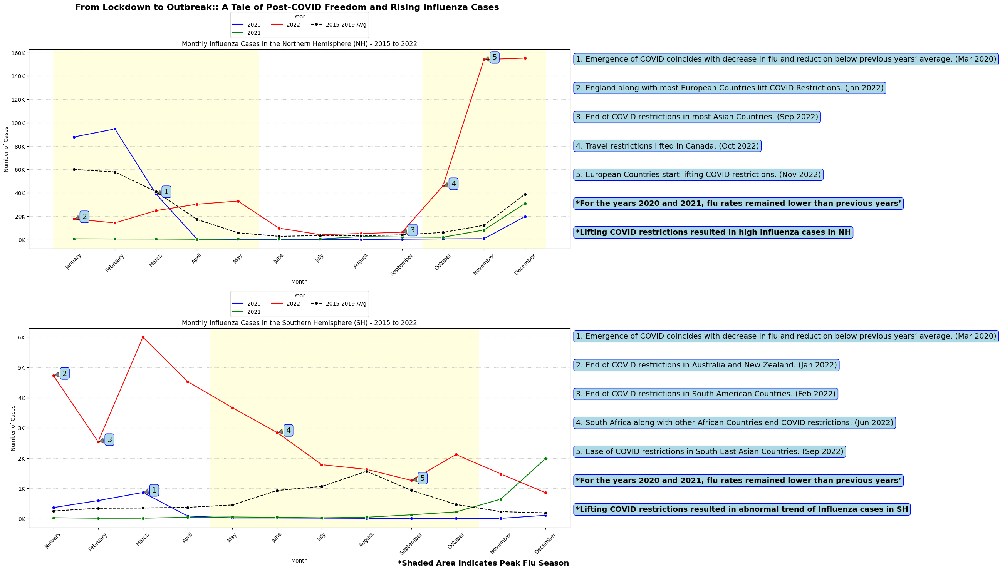

# Final Project - CS 625, Fall 2023

Maaz Hasnain Khan 

Due: December 11, 2023

# Raw Data

FluNet, an online platform initiated in 1997, serves as a vital tool for worldwide surveillance of influenza viruses. It plays a crucial role in monitoring and understanding the global spread of these viruses by collecting and providing virological data, such as the count of influenza viruses categorized by subtype. This information is instrumental in interpreting epidemiological data. Using data acquired through FluNet, we will apply data science and data visualization techniques to analyze influenza virus trends in the pre and post-COVID-19 era. The raw dataset can be accessed through the link below:

Raw Dataset Link: **[Global Influenza Programme - FluNet](https://www.who.int/tools/flunet)**

## Data Wrangling/Cleaning

```

import pandas as pd
from google.colab import drive

drive.mount("/content/drive", force_remount = True)

influenza_df = pd.read_csv("/content/drive/MyDrive/CS_620/CS_620_Data_Project/VIW_FNT.csv")

columns_to_replace_null = [
    'AH1N12009', 'AH1', 'AH3', 'AH5', 'AH7N9',
    'ANOTSUBTYPED', 'ANOTSUBTYPABLE', 'AOTHER_SUBTYPE', 'AOTHER_SUBTYPE_DETAILS',
    'INF_A', 'BVIC_2DEL', 'BVIC_3DEL', 'BVIC_NODEL', 'BVIC_DELUNK',
    'BYAM', 'BNOTDETERMINED', 'INF_B', 'INF_ALL', 'INF_NEGATIVE',
    'ILI_ACTIVITY', 'ADENO', 'BOCA', 'HUMAN_CORONA', 'METAPNEUMO',
    'PARAINFLUENZA', 'RHINO', 'RSV', 'OTHERRESPVIRUS'
]

influenza_df[columns_to_replace_null] = influenza_df[columns_to_replace_null].fillna(0)

columns_to_remove = ['ITZ', 'MMWR_WEEKSTARTDATE', 'MMWR_YEAR', 'MMWR_WEEK', 'ORIGIN_SOURCE', 'SPEC_RECEIVED_NB', 'AOTHER_SUBTYPE_DETAILS', 'ILI_ACTIVITY', 'ADENO', 'BOCA', 'HUMAN_CORONA', 'METAPNEUMO', 'PARAINFLUENZA', 'RHINO', 'RSV', 'OTHERRESPVIRUS','OTHER_RESPVIRUS_DETAILS', 'LAB_RESULT_COMMENT', 'WCR_COMMENT', 'ISO2', 'ISOYW', 'MMWRYW']
influenza_df = influenza_df.drop(columns=columns_to_remove)

columns_to_convert = [
    'SPEC_PROCESSED_NB', 'AH1N12009', 'AH1', 'AH3', 'AH5', 'AH7N9',
    'ANOTSUBTYPED', 'ANOTSUBTYPABLE', 'AOTHER_SUBTYPE', 'INF_A', 'BVIC_2DEL', 'BVIC_3DEL', 'BVIC_NODEL', 'BVIC_DELUNK',
    'BYAM', 'BNOTDETERMINED', 'INF_B', 'INF_ALL', 'INF_NEGATIVE',

]

influenza_df[columns_to_convert] = influenza_df[columns_to_convert].apply(pd.to_numeric)

influenza_df = influenza_df.dropna(subset=['SPEC_PROCESSED_NB'])

columns_to_sum = [
    'INF_ALL', 'INF_NEGATIVE'
]

sum_of_columns = influenza_df[columns_to_sum].sum(axis=1)

influenza_df = influenza_df[sum_of_columns == influenza_df["SPEC_PROCESSED_NB"]]

sum_columns_set1 = influenza_df[['AH1N12009', 'AH1', 'AH3', 'AH5', 'AH7N9', 'ANOTSUBTYPED', 'ANOTSUBTYPABLE', 'AOTHER_SUBTYPE']].sum(axis=1)

sum_columns_set2 = influenza_df[['BVIC_2DEL', 'BVIC_3DEL', 'BVIC_NODEL', 'BVIC_DELUNK', 'BYAM', 'BNOTDETERMINED']].sum(axis=1)

influenza_df = influenza_df[(sum_columns_set1 == influenza_df['INF_A']) & (sum_columns_set2 == influenza_df['INF_B'])]

sum_inf_a_b = influenza_df["INF_A"] + influenza_df["INF_B"]

influenza_df = influenza_df[sum_inf_a_b == influenza_df["INF_ALL"]]

influenza_df = influenza_df[influenza_df['SPEC_PROCESSED_NB'] != 0]

influenza_df['ISO_WEEKSTARTDATE'] = pd.to_datetime(influenza_df['ISO_WEEKSTARTDATE'])

years_to_explore = [2015, 2016, 2017, 2018, 2019, 2020, 2021, 2022]
filtered_df = influenza_df[influenza_df['ISO_YEAR'].isin(years_to_explore)].copy()

filtered_df['Month'] = filtered_df['ISO_WEEKSTARTDATE'].dt.month_name()
filtered_df['Year'] = filtered_df['ISO_YEAR']

month_order = ['January', 'February', 'March', 'April', 'May', 'June', 'July', 'August', 'September', 'October', 'November', 'December']
filtered_df['Month'] = pd.Categorical(filtered_df['Month'], categories=month_order, ordered=True)

agg_df = filtered_df.groupby(['HEMISPHERE', 'Year', 'Month']).agg({'INF_ALL': 'sum'}).reset_index()

```

#### Explanation

First, the data is loaded from a CSV file, and missing values in specified columns are replaced with zeros. Unnecessary columns are then removed, and certain columns are converted to numeric types. Rows with missing values in a crucial column 'SPEC_PROCESSED_NB' (Specimen Processed for Influenza) are dropped. This column is crucial as it will help us in filtering the data which doesn't add up. The subsequent steps involve intricate filtering. Rows are retained where the sum of 'INF_ALL' (Total Positive Influenza Cases) and 'INF_NEGATIVE' (Total Negative Influenza Cases) matches the 'SPEC_PROCESSED_NB' (Specimen Processed for Influenza) value. Becuase if they don't match then there is something worng, therefore, it was decided that it is better to drop these rows. Similarly, further filtering is done to ensure that the sums of specific sets of columns containing subtypes of Influenza Type A and Influenza Type B align with their parent columns. A final filter is applied to keep only the rows where the sum of 'INF_A' (Influenza Type A) and 'INF_B' (Influenza Type B) equals the 'INF_ALL' (Total Influenza Cases) column. Additionally, rows with 'SPEC_PROCESSED_NB' (Specimen Processed for Influenza) values not equal to zero are retained. This data still had some columns and rows which needed to be processed. But we will discuss that in Final Chart's code explanation as they are closely linked together.

# Final Question

**Q. Has the relaxation of COVID-19 restrictions influenced the resurgence of influenza, and what patterns emerge when examining influenza cases both during and in the aftermath of pandemic-related lockdowns in Northern Hemisphere (NH) and Southern Hemisphere (SH)?**

# Final Chart



## Final Chart Code

```

import pandas as pd
import matplotlib.pyplot as plt
import seaborn as sns

def format_yaxis_labels(value, _):
    return "{:,.0f}K".format(value / 1000)

influenza_df['ISO_WEEKSTARTDATE'] = pd.to_datetime(influenza_df['ISO_WEEKSTARTDATE'])

years_to_plot = [2015, 2016, 2017, 2018, 2019, 2020, 2021, 2022]
filtered_df = influenza_df[influenza_df['ISO_YEAR'].isin(years_to_plot)].copy()

filtered_df['Month'] = filtered_df['ISO_WEEKSTARTDATE'].dt.month_name()
filtered_df['Year'] = filtered_df['ISO_YEAR']

month_order = ['January', 'February', 'March', 'April', 'May', 'June', 'July', 'August', 'September', 'October', 'November', 'December']
filtered_df['Month'] = pd.Categorical(filtered_df['Month'], categories=month_order, ordered=True)

line_colors = ['blue', 'green', 'red']

plt.figure(figsize=(15, 15))

agg_df = filtered_df.groupby(['HEMISPHERE', 'Year', 'Month']).agg({'INF_ALL': 'sum'}).reset_index()

avg_df_nh = agg_df[(agg_df['HEMISPHERE'] == 'NH') & (agg_df['Year'].isin([2015, 2016, 2017, 2018, 2019]))].groupby(['Month']).agg({'INF_ALL': 'mean'}).reset_index()
avg_df_sh = agg_df[(agg_df['HEMISPHERE'] == 'SH') & (agg_df['Year'].isin([2015, 2016, 2017, 2018, 2019]))].groupby(['Month']).agg({'INF_ALL': 'mean'}).reset_index()

nh_annotations = [
    ("1. Emergence of COVID coincides with decrease in flu and reduction below previous years’ average. (Mar 2020)", "March", 2020),
    ("2. England along with most European Countries lift COVID Restrictions. (Jan 2022)", "January", 2022),
    ("3. End of COVID restrictions in most Asian Countries. (Sep 2022)", "September", 2022),
    ("4. Travel restrictions lifted in Canada. (Oct 2022)", "October", 2022),
    ("5. European Countries start lifting COVID restrictions. (Nov 2022)", "November", 2022)
]

plt.suptitle("From Lockdown to Outbreak: A Tale of Post-COVID Freedom and Rising Influenza Cases", fontsize=16, fontweight='bold')

plt.subplot(2, 1, 1)
sns.lineplot(x='Month', y='INF_ALL', hue='Year', data=agg_df[(agg_df['HEMISPHERE'] == 'NH') & (~agg_df['Year'].isin([2015, 2016, 2017, 2018, 2019]))], marker='o', palette=line_colors)
sns.lineplot(x='Month', y='INF_ALL', data=avg_df_nh, marker='o', color='black', linestyle='--', label='2015-2019 Avg')

plt.xlabel('Month')
plt.ylabel('Number of Cases')
plt.title('Monthly Influenza Cases in the Northern Hemisphere (NH) - 2015 to 2022')
plt.xticks(rotation=45)
plt.legend(title="Year", loc="upper center", bbox_to_anchor=(0.5, 1.20), ncol=3)

for year in years_to_plot:
    flu_season_months = ['October', 'November', 'December', 'January', 'February', 'March', 'April', 'May']
    for month in flu_season_months:
        plt.axvspan(month_order.index(month) - 0.5, month_order.index(month) + 0.5, color='lightyellow', alpha=0.5)

for i, (annotation, month, year) in enumerate(nh_annotations, 1):
    x_pos = month_order.index(month)
    y_pos = agg_df[(agg_df['HEMISPHERE'] == 'NH') & (agg_df['Year'] == year) & (agg_df['Month'] == month)]['INF_ALL'].values[0]

    plt.annotate(f'{i}', xy=(x_pos, y_pos), xytext=(x_pos + 0.2, y_pos),
                 arrowprops=dict(facecolor='black', arrowstyle='wedge,tail_width=0.7', alpha=0.5),
                 bbox=dict(boxstyle='round', facecolor='lightblue', edgecolor='blue'), fontsize=14)

plt.gca().get_yaxis().set_major_formatter(plt.FuncFormatter(format_yaxis_labels))
plt.grid(axis='y', linestyle='dotted', alpha=0.7)

sh_annotations = [
    ("1. Emergence of COVID coincides with decrease in flu and reduction below previous years’ average. (Mar 2020)", "March", 2020),
    ("2. End of COVID restrictions in Australia and New Zealand. (Jan 2022)", "January", 2022),
    ("3. End of COVID restrictions in South American Countries. (Feb 2022)", "February", 2022),
    ("4. South Africa along with other African Countries end COVID restrictions. (Jun 2022)", "June", 2022),
    ("5. Ease of COVID restrictions in South East Asian Countries. (Sep 2022)", "September", 2022)
]

plt.subplot(2, 1, 2)
sns.lineplot(x='Month', y='INF_ALL', hue='Year', data=agg_df[(agg_df['HEMISPHERE'] == 'SH') & (~agg_df['Year'].isin([2015, 2016, 2017, 2018, 2019]))], marker='o', palette=line_colors)
sns.lineplot(x='Month', y='INF_ALL', data=avg_df_sh, marker='o', color='black', linestyle='--', label='2015-2019 Avg')

plt.xlabel('Month')
plt.ylabel('Number of Cases')
plt.title('Monthly Influenza Cases in the Southern Hemisphere (SH) - 2015 to 2022')
plt.xticks(rotation=45)
plt.legend(title="Year", loc="upper center", bbox_to_anchor=(0.5, 1.20), ncol=3)

for year in years_to_plot:
    flu_season_months = ['May', 'June', 'July', 'August', 'September', 'October']
    for month in flu_season_months:
        plt.axvspan(month_order.index(month) - 0.5, month_order.index(month) + 0.5, color='lightyellow', alpha=0.5)

for i, (annotation, month, year) in enumerate(sh_annotations, 1):
    x_pos = month_order.index(month)
    y_pos = agg_df[(agg_df['HEMISPHERE'] == 'SH') & (agg_df['Year'] == year) & (agg_df['Month'] == month)]['INF_ALL'].values[0]

    plt.annotate(f'{i}', xy=(x_pos, y_pos), xytext=(x_pos + 0.2, y_pos),
                 arrowprops=dict(facecolor='black', arrowstyle='wedge,tail_width=0.7', alpha=0.5),
                 bbox=dict(boxstyle='round', facecolor='lightblue', edgecolor='blue'), fontsize=14)

plt.gca().get_yaxis().set_major_formatter(plt.FuncFormatter(format_yaxis_labels))
plt.grid(axis='y', linestyle='dotted', alpha=0.7)

plt.tight_layout()

figtext_y_position = 0.8
plt.figtext(1.0, figtext_y_position + 0.08, "1. Emergence of COVID coincides with decrease in flu and reduction below previous years’ average. (Mar 2020)", fontsize=14, bbox=dict(boxstyle='round', facecolor='lightblue', edgecolor='blue'))
plt.figtext(1.0, figtext_y_position + 0.03, "2. England along with most European Countries lift COVID Restrictions. (Jan 2022)", fontsize=14, bbox=dict(boxstyle='round', facecolor='lightblue', edgecolor='blue'))
plt.figtext(1.0, figtext_y_position - 0.02, "3. End of COVID restrictions in most Asian Countries. (Sep 2022)", fontsize=14, bbox=dict(boxstyle='round', facecolor='lightblue', edgecolor='blue'))
plt.figtext(1.0, figtext_y_position - 0.07, "4. Travel restrictions lifted in Canada. (Oct 2022)", fontsize=14, bbox=dict(boxstyle='round', facecolor='lightblue', edgecolor='blue'))
plt.figtext(1.0, figtext_y_position - 0.12, "5. European Countries start lifting COVID restrictions. (Nov 2022)", fontsize=14, bbox=dict(boxstyle='round', facecolor='lightblue', edgecolor='blue'))
plt.figtext(1.0, figtext_y_position - 0.17, "*For the years 2020 and 2021, flu rates remained lower than previous years’", fontsize=14, fontweight='bold', bbox=dict(boxstyle='round', facecolor='lightblue', edgecolor='blue'))
plt.figtext(1.0, figtext_y_position - 0.22, "*Lifting COVID restrictions resulted in high Influenza cases in NH", fontsize=14, fontweight='bold', bbox=dict(boxstyle='round', facecolor='lightblue', edgecolor='blue'))

plt.figtext(1.0, figtext_y_position - 0.40, "1. Emergence of COVID coincides with decrease in flu and reduction below previous years’ average. (Mar 2020)", fontsize=14, bbox=dict(boxstyle='round', facecolor='lightblue', edgecolor='blue'))
plt.figtext(1.0, figtext_y_position - 0.45, "2. End of COVID restrictions in Australia and New Zealand. (Jan 2022)", fontsize=14, bbox=dict(boxstyle='round', facecolor='lightblue', edgecolor='blue'))
plt.figtext(1.0, figtext_y_position - 0.50, "3. End of COVID restrictions in South American Countries. (Feb 2022)", fontsize=14, bbox=dict(boxstyle='round', facecolor='lightblue', edgecolor='blue'))
plt.figtext(1.0, figtext_y_position - 0.55, "4. South Africa along with other African Countries end COVID restrictions. (Jun 2022)", fontsize=14, bbox=dict(boxstyle='round', facecolor='lightblue', edgecolor='blue'))
plt.figtext(1.0, figtext_y_position - 0.60, "5. Ease of COVID restrictions in South East Asian Countries. (Sep 2022)", fontsize=14, bbox=dict(boxstyle='round', facecolor='lightblue', edgecolor='blue'))
plt.figtext(1.0, figtext_y_position - 0.65, "*For the years 2020 and 2021, flu rates remained lower than previous years’", fontsize=14, fontweight='bold', bbox=dict(boxstyle='round', facecolor='lightblue', edgecolor='blue'))
plt.figtext(1.0, figtext_y_position - 0.70, "*Lifting COVID restrictions resulted in abnormal trend of Influenza cases in SH", fontsize=14, fontweight='bold', bbox=dict(boxstyle='round', facecolor='lightblue', edgecolor='blue'))

plt.figtext(0.84, 0.01, '*Shaded Area Indicates Peak Flu Season', ha='center', va='center', fontsize=14, fontweight='bold', color='black')

plt.show()

```

#### Explanation

To create this chart we have used Matplotlib, and Seaborn libraries to create a Multiple Line Chart of influenza cases spanning from 2015 to 2022. Initially, the code modifies the influenza dataset by focusing on time-related details. First, we change the column 'ISO_WEEKSTARTDATE' (Date of Sample Test) to a format that makes it easier to work with dates. After that, a subset of the data is created, including only the years 2015 to 2022. This is done by looking at the 'ISO_YEAR' (Year) column in the original dataset. Next, two new columns are added to this subset. One column, 'Month,' gets its values from the month names in the 'ISO_WEEKSTARTDATE' (Date of Sample Test) column. The other column, 'Year,' takes its values from the 'ISO_YEAR' (Year) column. To make sure the months are in the correct order when visualizing the data, the 'Month' column is turned into a special type that follows a specific sequence, going from 'January' to 'December'.

The code then generates two subplots, one for the Northern Hemisphere (NH) and the other for the Southern Hemisphere (SH). Each subplot depicts monthly influenza cases, with individual years (2020, 2021, and 2022) represented by distinct colored lines, while the years 2015 to 2019 are averaged and portrayed as a single black dotted line. The x-axis denotes months, the y-axis represents the total number of inlfuenza cases, the colors represent the years, and the title for each subplot specifies the hemisphere. The charts are shaded with yellow regions indicating peak flu seasons. Important events related to COVID-19, such as the emergence of the pandemic and the lifting of restrictions, are marked with annotations. The NH subplot underscores the correlation between eased COVID-19 measures and an increase in influenza cases. Conversely, the SH subplot exhibits an abnormal trend post-COVID restrictions. The code concludes with additional textual annotations emphasizing the observed trends and providing context to the plotted data.

To see the charts go to **[Google Colaboratory Notebook](https://colab.research.google.com/drive/1nazt4QLD9pucsnBnjHBnVpJdL78tZp3Y?usp=sharing).**

Idiom: Multiple Line Chart / Mark: Dots
| Data: Attribute | Data: Attribute Type  | Encode: Channel | 
| --- |---| --- |
| Months | Key, Temporal | Horizontal Position (X-axis) |
| Total Number of Influenza Cases | Value, Quantitative | Vertical Position (Y-axis) |
| Year | Key, Temporal | Color Hue (Third Channel) |

# Chart Interpretation in Context of the Question

The chart titled "From Lockdown to Outbreak: A Tale of Post-COVID Freedom and Rising Influenza Cases" looks into the intricate relationship between the COVID-19 pandemic and the resurgence of influenza cases worldwide. The primary question guiding this exploration is: "Has the relaxation of COVID-19 restrictions influenced the resurgence of influenza, and what patterns emerge when examining influenza cases during and after pandemic-related lockdowns in the Northern Hemisphere (NH) and Southern Hemisphere (SH)?"

So how does this chart actually answers this question? Well, actually the chart provides a visual narrative of influenza cases spanning from 2015 to 2022, capturing the years preceding and following the emergence of COVID-19. The x-axis represents months, the y-axis indicates the number of influenza cases, and the black dotted line represents the average influenza cases during the pre-COVID era (2015-2019) in both hemispheres. Colored lines represent influenza cases from 2020 to 2022.

The black dotted line in the Northern Hemisphere serves as a baseline, depicting the typical pattern of flu cases pre-COVID. A noticeable dip in March 2020 corresponds to the emergence of COVID-19. As COVID restrictions started to be lifted in January 2022, influenza cases surged, deviating from the pre-COVID pattern. The chart highlights key events, such as the lifting of COVID restrictions in England and European countries in January 2022 and the subsequent peak in influenza cases.

Similarly, in the Southern Hemisphere, the black dotted line represents the pre-COVID flu pattern. The chart reveals an abnormal trend post-COVID, with influenza cases rising even during the off-peak flu season. As COVID restrictions lifted in January 2022 in Australia, New Zealand, and South American countries, a distinct rise in influenza cases occurred, deviating from the pre-COVID pattern.

So, addressing the primary question, the chart strongly suggests a connection between the relaxation of COVID-19 restrictions and the resurgence of influenza in both hemispheres. The deviation from pre-COVID patterns aligns with the timing of COVID restrictions being lifted. Another reason is the potential impact of weakened immune systems during lockdowns, contributing to the observed trends. During lockdowns people stopped socializing and were confined to their homes. Since, being confined in homes means less exposure to outside worlds, in turn meaning less exposure to viruses and bacteria causing their immune systems to get weakened. Therefore, once the lockdowns and restrictions were lifted, people were more susceptible to contracting the influenza virus.

Influenza patterns post-COVID exhibit a nuanced relationship with the easing of restrictions. The surge in cases aligns with the timing of relaxation, suggesting a potential interplay between COVID measures and influenza dynamics. The abnormal trends observed post-COVID tells us that there indeed is a relation between COVID-19 restrictions and rise of influenza cases.

The headline, "From Lockdown to Outbreak," aptly encapsulates the journey depicted in the chart. It effectively communicates the transition from pandemic lockdowns to the resurgence of influenza cases, capturing the essence of the complex interplay between COVID-19 and influenza.

# Final Thoughts

The development process of creating the visualization, "From Lockdown to Outbreak," was a fascinating journey that unfolded over several days. It involved meticulous data analysis, chart design, and exploration of the nuanced relationship between COVID-19 restrictions and influenza patterns.

The process started with data collection and cleaning, ensuring the accuracy and relevance of the information. This phase, while crucial, was filled with lots of hardships due to the ill-structured dataset. The subsequent challenge was how to effectively communicate insights into a visually compelling chart. The most time-consuming aspect was dedicated to accurately plotting the black dotted line, symbolizing the average influenza cases in the pre-COVID era (2015-2019). Creating this baseline required careful consideration of the data and meticulous calculations. Ensuring that the line accurately represented the average cases during the specified period demanded precision and accuracy. Iterative adjustments were made to align the line with historical trends while allowing for meaningful comparison with post-COVID influenza cases. In total, the development of the visualization took approximately 3 days, excluding the initial data cleaning and the final refinements to enhance the chart's aesthetic appeal.

While the visualization provides valuable insights into the interplay between COVID-19 restrictions and influenza dynamics, it is essential to acknowledge its limitations. Further research is warranted to explore additional hidden trends and contributing factors. Possible areas of investigation could include the impact of vaccination rates, population density, and varying healthcare infrastructures on influenza patterns.

## References

* Final Chart, [Final Chart](CS625_Final_Project_Final_Chart.png)
* Raw Influenza Dataset, [Raw Influenza Dataset](Raw_Dataset.csv)
* Filtered Influenza Data, [Filtered Influenza Data](influenza_df.csv)
* Final Influenza Data, [Final Influenza Data](agg_df.csv)
* Line Chart Sketch, [Line Chart Sketch](Line_Chart_Sketch.jpeg)
* Bar Chart Sketch, [Bar Chart Sketch](Bar_Chart_Sketch.jpeg)
* Google Colaboratory Notebook, [Google Colaboratory Notebook](CS_625_Data_Visualization_Project.ipynb)
* Final Video Presentation, [Final Video Presentation](CS625_Final_Project_Video_Presentation.mp4)
* Pandas, <https://pandas.pydata.org/docs/reference/api/pandas.Categorical.html>
* Pandas, <https://pandas.pydata.org/docs/reference/api/pandas.DataFrame.groupby.html>
* Pandas, <https://pandas.pydata.org/docs/reference/api/pandas.DataFrame.agg.html>
* Pandas, <https://pandas.pydata.org/docs/reference/api/pandas.Series.dt.month_name.html>
* Pandas, <https://pandas.pydata.org/docs/reference/api/pandas.to_datetime.html>
* Seaborn, <https://seaborn.pydata.org/generated/seaborn.lineplot.html>
* Matplotlib, <https://matplotlib.org/stable/api/_as_gen/matplotlib.pyplot.suptitle.html>
* Matplotlib, <https://matplotlib.org/stable/api/_as_gen/matplotlib.pyplot.figtext.html>
* Matplotlib, <https://matplotlib.org/stable/api/_as_gen/matplotlib.axes.Axes.get_yaxis.html>
* Matplotlib, <https://matplotlib.org/stable/api/_as_gen/matplotlib.pyplot.subplot.html>
* Matplotlib, <https://matplotlib.org/stable/api/_as_gen/matplotlib.axis.Axis.set_major_formatter.html>
* Matplotlib, <https://matplotlib.org/stable/api/_as_gen/matplotlib.pyplot.gca.html>
* Matplotlib, <https://matplotlib.org/stable/api/_as_gen/matplotlib.pyplot.annotate.html>
* Matplotlib, <https://matplotlib.org/stable/api/_as_gen/matplotlib.pyplot.axvspan.html>
* Stackoverflow, <https://stackoverflow.com/questions/55767312/how-to-position-suptitle>
* Stackoverflow, <https://stackoverflow.com/questions/13112103/using-figtext-in-python>
* Stackoverflow, <https://stackoverflow.com/questions/25119193/matplotlib-pyplot-axes-formatter>
* Stackoverflow, <https://stackoverflow.com/questions/45381589/how-does-plt-gca-work-internally>
* Stackoverflow, <https://stackoverflow.com/questions/47122340/is-there-a-way-to-annotate-each-point-on-a-scatter-with-a-list-of-strings>
* Stackoverflow, <https://stackoverflow.com/questions/36423221/matplotlib-axvspan-solid-fill>
* Stackoverflow, <https://stackoverflow.com/questions/52308749/how-do-i-create-a-multiline-plot-using-seaborn>
* Stackoverflow, <https://stackoverflow.com/questions/48000487/how-to-use-agg-method-to-calculate-the-column-average-in-pandas>
* Stackoverflow, <https://stackoverflow.com/questions/71731100/pandas-groupby-syntax-explanation>
* Stackoverflow, <https://stackoverflow.com/questions/37625334/convert-month-int-to-month-name-in-pandas>
* Stackoverflow, <https://stackoverflow.com/questions/40511476/how-to-properly-use-funcformatterfunc>
* Youtube, <https://www.youtube.com/watch?v=NWiRelBdwyk>
* Youtube, <https://www.youtube.com/watch?v=td8d9eERyTY>
* Youtube, <https://www.youtube.com/watch?v=Pry6_wn6DDw>
* Youtube, <https://www.youtube.com/watch?v=wp2-dEe2St4>
* Youtube, <https://www.youtube.com/watch?v=VRmXto2YA2I>
* University of Cambridge, <https://www.cam.ac.uk/research/news/seasonal-immunity-activity-of-thousands-of-genes-differs-from-winter-to-summer>
* Medium, <https://balaji4u.medium.com/adding-annotations-to-seaborn-plots-5e5b134140c8>
* Bloomberg, <https://www.bloomberg.com/news/articles/2022-09-23/asia-save-china-is-finally-lifting-its-last-pandemic-rules>
* CNN, <https://www.cnn.com/travel/article/asia-covid-reopening-china-intl-hnk-mic/index.html>
* U.S. Embassy SA, <https://za.usembassy.gov/covid-19-information/#:~:text=On%20June%2022%2C%202022%2C%20the,Government%20of%20South%20Africa's%20announcement%20.>
* Los Angeles Times, <https://www.latimes.com/world-nation/story/2022-04-28/latin-american-nations-ease-restrictions-covid-cases-drop>
* CNBC, <https://www.cnbc.com/2022/02/11/european-countries-scrap-covid-rules-despite-warnings-its-too-soon.html>
* EuroNews, <https://www.euronews.com/2022/02/23/covid-19-in-europe-italy-to-end-state-of-emergency-and-ease-restrictions-in-april>
* Wikipedia, <https://en.wikipedia.org/wiki/Flu_season>
* Wikipedia, <https://en.wikipedia.org/wiki/COVID-19_pandemic_in_Europe>
* Wikipedia, <https://en.wikipedia.org/wiki/U.S._state_and_local_government_responses_to_the_COVID-19_pandemic>
* Wikipedia, <https://en.wikipedia.org/wiki/COVID-19_lockdowns>
* Wikipedia, <https://en.wikipedia.org/wiki/COVID-19_pandemic_in_Australia>
* TIME, <https://time.com/6248365/flu-influenza-winter-2023-bad-covid-19>
* Reuters, <https://www.reuters.com/world/us/us-seeing-most-flu-hospitalizations-cases-decade-cdc-says-2022-12-05>
* Reuters, <https://www.reuters.com/world/asia-pacific/singapore-relax-more-covid-curbs-including-overseas-arrivals-2022-03-24>
* IHME, <https://covid19.healthdata.org/global?view=infections-testing&tab=trend&test=infections>